# Architectural & Detailed Design Document

## Agent-Based Intelligent Threat Detection & Response System

---

## 1. System Overview

This system is a real-time cybersecurity monitoring platform built on an **agent-based architecture**. Independent security agents detect threats (DDoS, brute-force, port scanning), automatically respond via firewall rules, and report to a central server — all visualized on a live dashboard.

---

## 2. High-Level Architecture

### 2.1 System Context Diagram

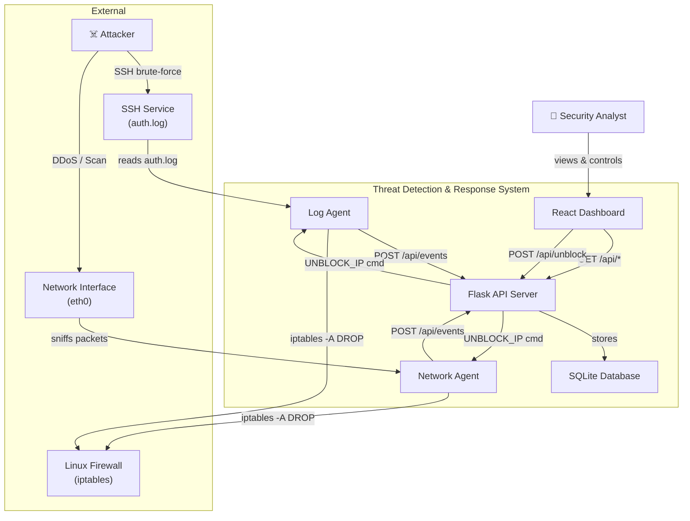
```mermaid
graph TB
    subgraph External
        ATK["☠️ Attacker"]
        SSH["SSH Service<br/>(auth.log)"]
        NET["Network Interface<br/>(eth0)"]
        FW["Linux Firewall<br/>(iptables)"]
    end

    subgraph System["Threat Detection & Response System"]
        LA["Log Agent"]
        NA["Network Agent"]
        SRV["Flask API Server"]
        DB["SQLite Database"]
        UI["React Dashboard"]
    end

    USER["👤 Security Analyst"]

    ATK -->|"SSH brute-force"| SSH
    ATK -->|"DDoS / Scan"| NET
    SSH -->|"reads auth.log"| LA
    NET -->|"sniffs packets"| NA
    LA -->|"POST /api/events"| SRV
    NA -->|"POST /api/events"| SRV
    LA -->|"iptables -A DROP"| FW
    NA -->|"iptables -A DROP"| FW
    SRV -->|"stores"| DB
    UI -->|"GET /api/*"| SRV
    USER -->|"views & controls"| UI
    UI -->|"POST /api/unblock"| SRV
    SRV -->|"UNBLOCK_IP cmd"| LA
    SRV -->|"UNBLOCK_IP cmd"| NA
```

### 2.2 Component Diagram

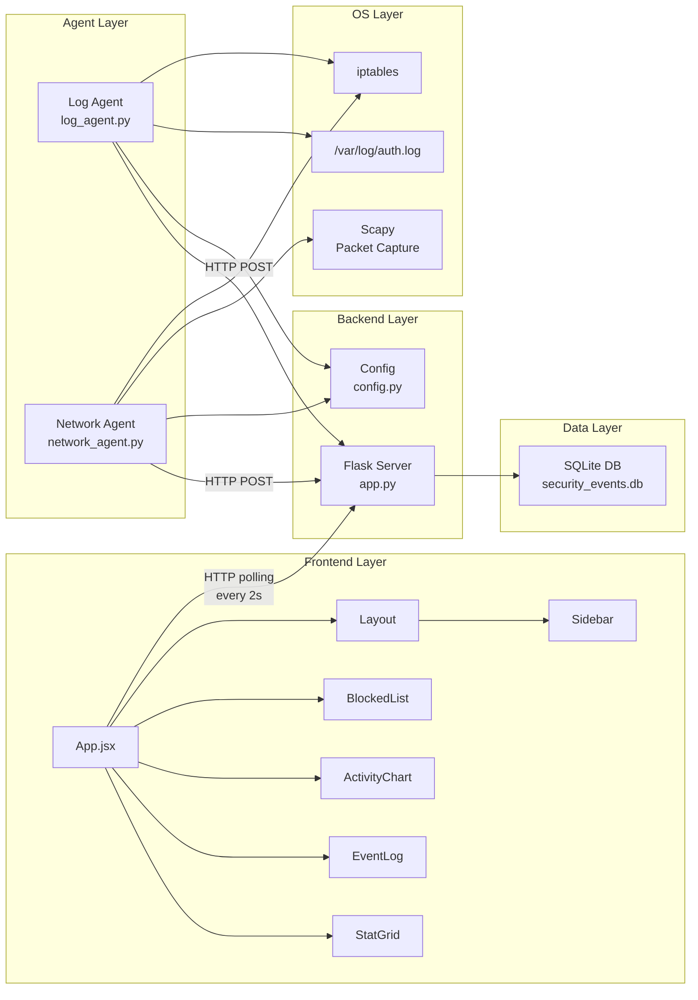
```mermaid
graph LR
    subgraph Frontend["Frontend Layer"]
        APP["App.jsx"]
        SG["StatGrid"]
        EL["EventLog"]
        AC["ActivityChart"]
        BL["BlockedList"]
        SB["Sidebar"]
        LO["Layout"]
    end

    subgraph Backend["Backend Layer"]
        FLASK["Flask Server<br/>app.py"]
        CFG["Config<br/>config.py"]
    end

    subgraph Agents["Agent Layer"]
        LOG["Log Agent<br/>log_agent.py"]
        NETA["Network Agent<br/>network_agent.py"]
    end

    subgraph Data["Data Layer"]
        SQLITE["SQLite DB<br/>security_events.db"]
    end

    subgraph OS["OS Layer"]
        AUTHLOG["/var/log/auth.log"]
        IPTABLES["iptables"]
        SCAPY["Scapy<br/>Packet Capture"]
    end

    APP --> SG & EL & AC & BL
    APP --> LO --> SB
    APP -->|"HTTP polling<br/>every 2s"| FLASK
    FLASK --> SQLITE
    LOG -->|"HTTP POST"| FLASK
    NETA -->|"HTTP POST"| FLASK
    LOG --> CFG
    NETA --> CFG
    LOG --> AUTHLOG
    LOG --> IPTABLES
    NETA --> SCAPY
    NETA --> IPTABLES
```

---

## 3. Deployment Diagram

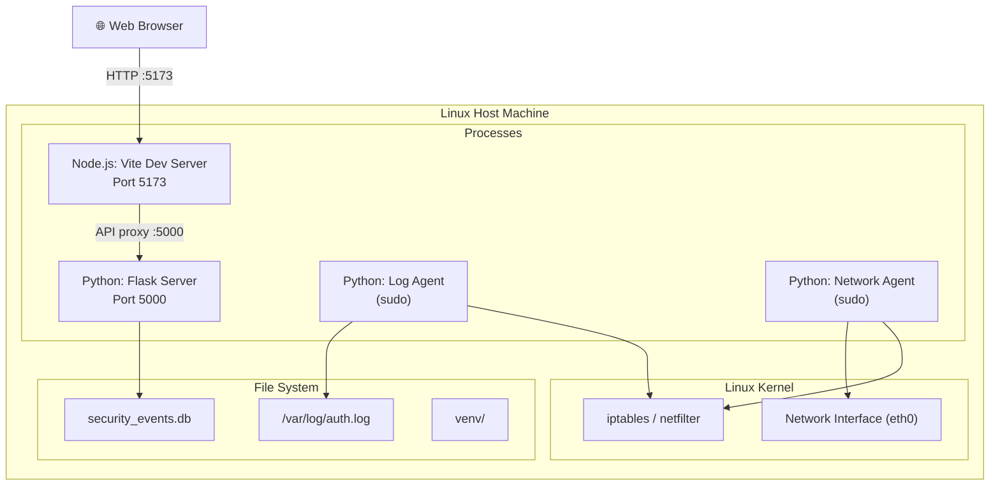
```mermaid
graph TB
    subgraph HOST["Linux Host Machine"]
        subgraph PROC["Processes"]
            P1["Python: Flask Server<br/>Port 5000"]
            P2["Python: Log Agent<br/>(sudo)"]
            P3["Python: Network Agent<br/>(sudo)"]
            P4["Node.js: Vite Dev Server<br/>Port 5173"]
        end

        subgraph FS["File System"]
            DB2["security_events.db"]
            AUTH["/var/log/auth.log"]
            VENV["venv/"]
        end

        subgraph KERNEL["Linux Kernel"]
            IPT["iptables / netfilter"]
            NIC["Network Interface (eth0)"]
        end
    end

    BROWSER["🌐 Web Browser"] -->|"HTTP :5173"| P4
    P4 -->|"API proxy :5000"| P1
    P1 --> DB2
    P2 --> AUTH
    P2 --> IPT
    P3 --> NIC
    P3 --> IPT
```

---

## 4. Database Design

### 4.1 Entity-Relationship Diagram

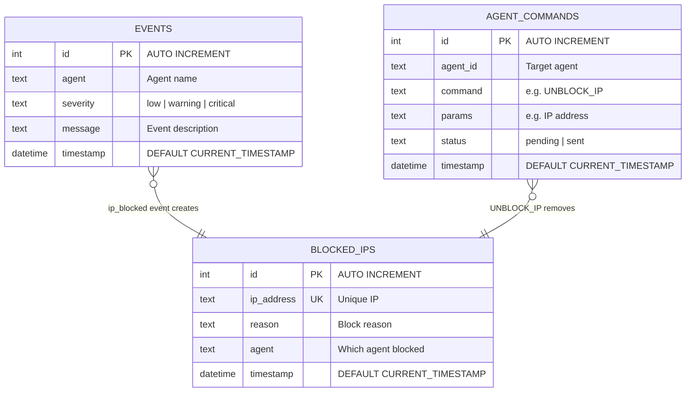
```mermaid
erDiagram
    EVENTS {
        int id PK "AUTO INCREMENT"
        text agent "Agent name"
        text severity "low | warning | critical"
        text message "Event description"
        datetime timestamp "DEFAULT CURRENT_TIMESTAMP"
    }

    BLOCKED_IPS {
        int id PK "AUTO INCREMENT"
        text ip_address UK "Unique IP"
        text reason "Block reason"
        text agent "Which agent blocked"
        datetime timestamp "DEFAULT CURRENT_TIMESTAMP"
    }

    AGENT_COMMANDS {
        int id PK "AUTO INCREMENT"
        text agent_id "Target agent"
        text command "e.g. UNBLOCK_IP"
        text params "e.g. IP address"
        text status "pending | sent"
        datetime timestamp "DEFAULT CURRENT_TIMESTAMP"
    }

    EVENTS }o--|| BLOCKED_IPS : "ip_blocked event creates"
    AGENT_COMMANDS }o--|| BLOCKED_IPS : "UNBLOCK_IP removes"
```

---

## 5. Class Diagrams

### 5.1 Log Agent — Internal Structure

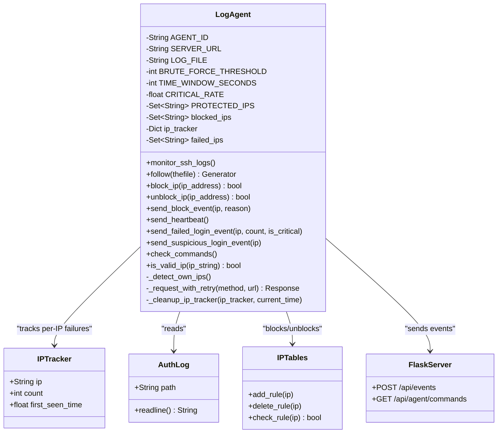
```mermaid
classDiagram
    class LogAgent {
        -String AGENT_ID
        -String SERVER_URL
        -String LOG_FILE
        -int BRUTE_FORCE_THRESHOLD
        -int TIME_WINDOW_SECONDS
        -float CRITICAL_RATE
        -Set~String~ PROTECTED_IPS
        -Set~String~ blocked_ips
        -Dict ip_tracker
        -Set~String~ failed_ips
        +monitor_ssh_logs()
        +follow(thefile) Generator
        +block_ip(ip_address) bool
        +unblock_ip(ip_address) bool
        +send_block_event(ip, reason)
        +send_heartbeat()
        +send_failed_login_event(ip, count, is_critical)
        +send_suspicious_login_event(ip)
        +check_commands()
        +is_valid_ip(ip_string) bool
        -_detect_own_ips()
        -_request_with_retry(method, url) Response
        -_cleanup_ip_tracker(ip_tracker, current_time)
    }

    class IPTracker {
        +String ip
        +int count
        +float first_seen_time
    }

    LogAgent --> IPTracker : "tracks per-IP failures"
    LogAgent --> AuthLog : "reads"
    LogAgent --> IPTables : "blocks/unblocks"
    LogAgent --> FlaskServer : "sends events"

    class AuthLog {
        +String path
        +readline() String
    }

    class IPTables {
        +add_rule(ip)
        +delete_rule(ip)
        +check_rule(ip) bool
    }

    class FlaskServer {
        +POST /api/events
        +GET /api/agent/commands
    }
```

### 5.2 Network Agent — Internal Structure

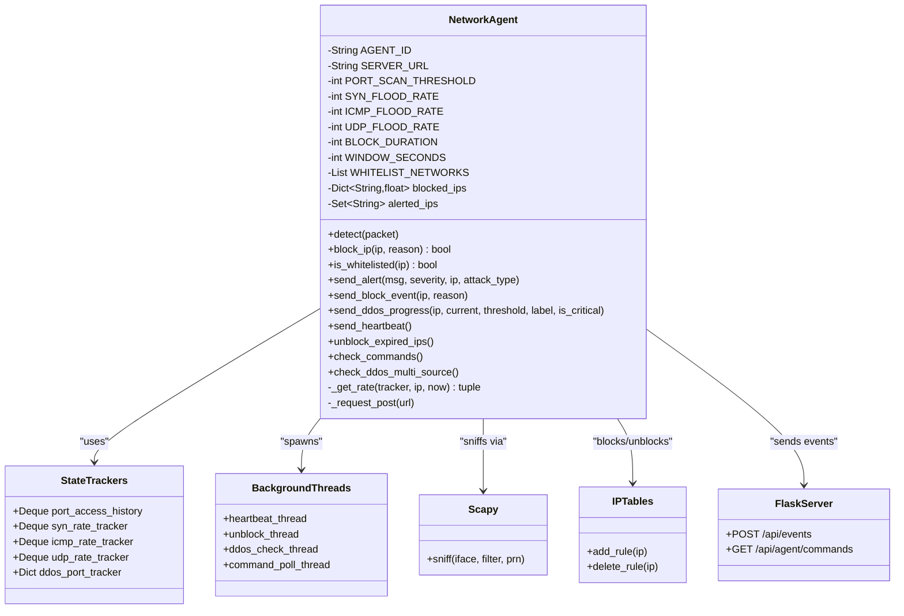
```mermaid
classDiagram
    class NetworkAgent {
        -String AGENT_ID
        -String SERVER_URL
        -int PORT_SCAN_THRESHOLD
        -int SYN_FLOOD_RATE
        -int ICMP_FLOOD_RATE
        -int UDP_FLOOD_RATE
        -int BLOCK_DURATION
        -int WINDOW_SECONDS
        -List WHITELIST_NETWORKS
        -Dict~String,float~ blocked_ips
        -Set~String~ alerted_ips
        +detect(packet)
        +block_ip(ip, reason) bool
        +is_whitelisted(ip) bool
        +send_alert(msg, severity, ip, attack_type)
        +send_block_event(ip, reason)
        +send_ddos_progress(ip, current, threshold, label, is_critical)
        +send_heartbeat()
        +unblock_expired_ips()
        +check_commands()
        +check_ddos_multi_source()
        -_get_rate(tracker, ip, now) tuple
        -_request_post(url)
    }

    class StateTrackers {
        +Deque port_access_history
        +Deque syn_rate_tracker
        +Deque icmp_rate_tracker
        +Deque udp_rate_tracker
        +Dict ddos_port_tracker
    }

    class BackgroundThreads {
        +heartbeat_thread
        +unblock_thread
        +ddos_check_thread
        +command_poll_thread
    }

    NetworkAgent --> StateTrackers : "uses"
    NetworkAgent --> BackgroundThreads : "spawns"
    NetworkAgent --> Scapy : "sniffs via"
    NetworkAgent --> IPTables : "blocks/unblocks"
    NetworkAgent --> FlaskServer : "sends events"

    class Scapy {
        +sniff(iface, filter, prn)
    }

    class IPTables {
        +add_rule(ip)
        +delete_rule(ip)
    }

    class FlaskServer {
        +POST /api/events
        +GET /api/agent/commands
    }
```

### 5.3 Flask Server — Class Diagram

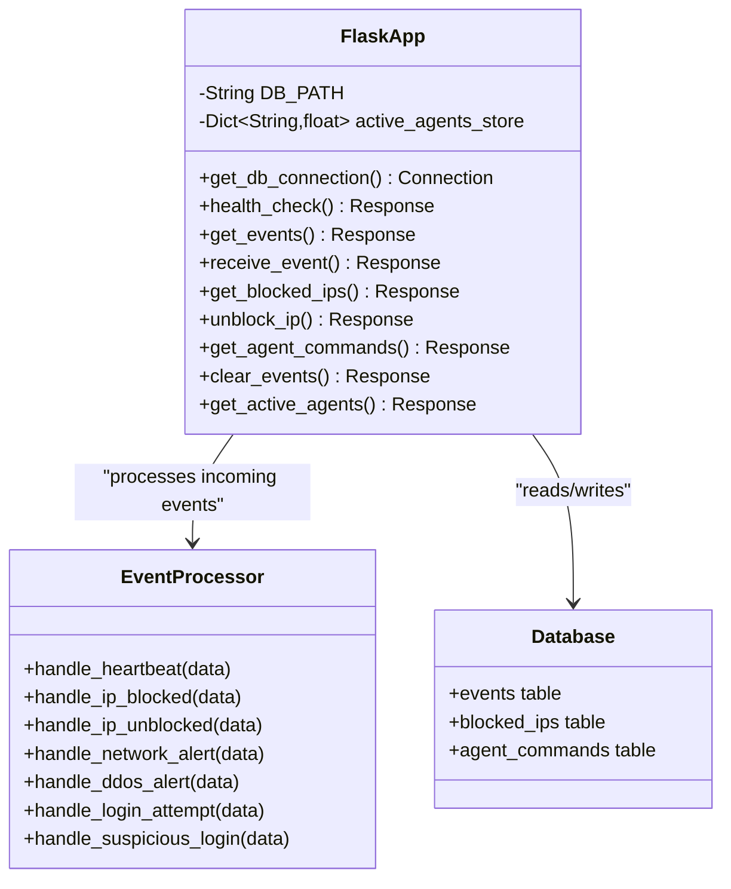
```mermaid
classDiagram
    class FlaskApp {
        -String DB_PATH
        -Dict~String,float~ active_agents_store
        +get_db_connection() Connection
        +health_check() Response
        +get_events() Response
        +receive_event() Response
        +get_blocked_ips() Response
        +unblock_ip() Response
        +get_agent_commands() Response
        +clear_events() Response
        +get_active_agents() Response
    }

    class EventProcessor {
        +handle_heartbeat(data)
        +handle_ip_blocked(data)
        +handle_ip_unblocked(data)
        +handle_network_alert(data)
        +handle_ddos_alert(data)
        +handle_login_attempt(data)
        +handle_suspicious_login(data)
    }

    class Database {
        +events table
        +blocked_ips table
        +agent_commands table
    }

    FlaskApp --> EventProcessor : "processes incoming events"
    FlaskApp --> Database : "reads/writes"
```

---

## 6. Sequence Diagrams

### 6.1 Brute-Force Attack Detection & Response (Log Agent)

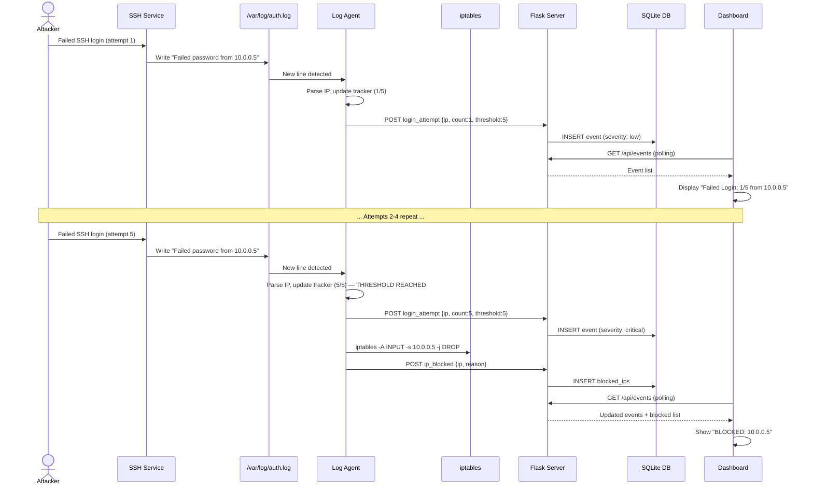
```mermaid
sequenceDiagram
    actor Attacker
    participant SSH as SSH Service
    participant AuthLog as /var/log/auth.log
    participant LA as Log Agent
    participant IPT as iptables
    participant SRV as Flask Server
    participant DB as SQLite DB
    participant UI as Dashboard

    Attacker->>SSH: Failed SSH login (attempt 1)
    SSH->>AuthLog: Write "Failed password from 10.0.0.5"
    AuthLog->>LA: New line detected
    LA->>LA: Parse IP, update tracker (1/5)
    LA->>SRV: POST login_attempt {ip, count:1, threshold:5}
    SRV->>DB: INSERT event (severity: low)
    UI->>SRV: GET /api/events (polling)
    SRV-->>UI: Event list
    UI->>UI: Display "Failed Login: 1/5 from 10.0.0.5"

    Note over Attacker,UI: ... Attempts 2-4 repeat ...

    Attacker->>SSH: Failed SSH login (attempt 5)
    SSH->>AuthLog: Write "Failed password from 10.0.0.5"
    AuthLog->>LA: New line detected
    LA->>LA: Parse IP, update tracker (5/5) — THRESHOLD REACHED
    LA->>SRV: POST login_attempt {ip, count:5, threshold:5}
    SRV->>DB: INSERT event (severity: critical)
    LA->>IPT: iptables -A INPUT -s 10.0.0.5 -j DROP
    LA->>SRV: POST ip_blocked {ip, reason}
    SRV->>DB: INSERT blocked_ips
    UI->>SRV: GET /api/events (polling)
    SRV-->>UI: Updated events + blocked list
    UI->>UI: Show "BLOCKED: 10.0.0.5"
```

### 6.2 DDoS Attack Detection & Response (Network Agent)

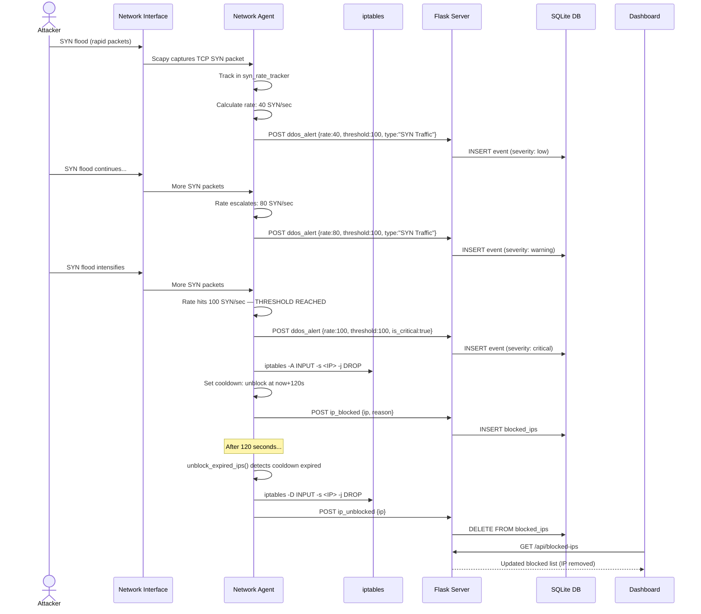
```mermaid
sequenceDiagram
    actor Attacker
    participant NIC as Network Interface
    participant NA as Network Agent
    participant IPT as iptables
    participant SRV as Flask Server
    participant DB as SQLite DB
    participant UI as Dashboard

    Attacker->>NIC: SYN flood (rapid packets)
    NIC->>NA: Scapy captures TCP SYN packet
    NA->>NA: Track in syn_rate_tracker
    NA->>NA: Calculate rate: 40 SYN/sec
    NA->>SRV: POST ddos_alert {rate:40, threshold:100, type:"SYN Traffic"}
    SRV->>DB: INSERT event (severity: low)

    Attacker->>NIC: SYN flood continues...
    NIC->>NA: More SYN packets
    NA->>NA: Rate escalates: 80 SYN/sec
    NA->>SRV: POST ddos_alert {rate:80, threshold:100, type:"SYN Traffic"}
    SRV->>DB: INSERT event (severity: warning)

    Attacker->>NIC: SYN flood intensifies
    NIC->>NA: More SYN packets
    NA->>NA: Rate hits 100 SYN/sec — THRESHOLD REACHED
    NA->>SRV: POST ddos_alert {rate:100, threshold:100, is_critical:true}
    SRV->>DB: INSERT event (severity: critical)
    NA->>IPT: iptables -A INPUT -s <IP> -j DROP
    NA->>NA: Set cooldown: unblock at now+120s
    NA->>SRV: POST ip_blocked {ip, reason}
    SRV->>DB: INSERT blocked_ips

    Note over NA: After 120 seconds...

    NA->>NA: unblock_expired_ips() detects cooldown expired
    NA->>IPT: iptables -D INPUT -s <IP> -j DROP
    NA->>SRV: POST ip_unblocked {ip}
    SRV->>DB: DELETE FROM blocked_ips
    UI->>SRV: GET /api/blocked-ips
    SRV-->>UI: Updated blocked list (IP removed)
```

### 6.3 Manual Unblock from Dashboard

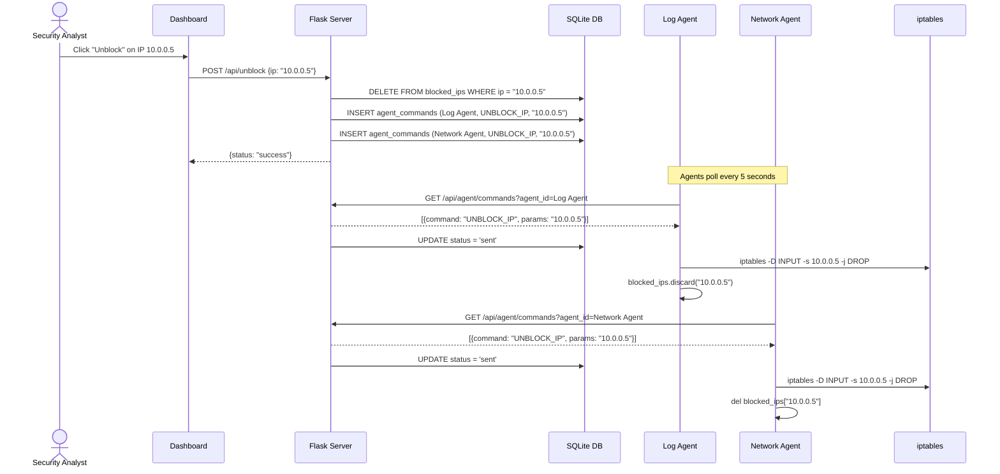
```mermaid
sequenceDiagram
    actor User as Security Analyst
    participant UI as Dashboard
    participant SRV as Flask Server
    participant DB as SQLite DB
    participant LA as Log Agent
    participant NA as Network Agent
    participant IPT as iptables

    User->>UI: Click "Unblock" on IP 10.0.0.5
    UI->>SRV: POST /api/unblock {ip: "10.0.0.5"}
    SRV->>DB: DELETE FROM blocked_ips WHERE ip = "10.0.0.5"
    SRV->>DB: INSERT agent_commands (Log Agent, UNBLOCK_IP, "10.0.0.5")
    SRV->>DB: INSERT agent_commands (Network Agent, UNBLOCK_IP, "10.0.0.5")
    SRV-->>UI: {status: "success"}

    Note over LA,NA: Agents poll every 5 seconds

    LA->>SRV: GET /api/agent/commands?agent_id=Log Agent
    SRV-->>LA: [{command: "UNBLOCK_IP", params: "10.0.0.5"}]
    SRV->>DB: UPDATE status = 'sent'
    LA->>IPT: iptables -D INPUT -s 10.0.0.5 -j DROP
    LA->>LA: blocked_ips.discard("10.0.0.5")

    NA->>SRV: GET /api/agent/commands?agent_id=Network Agent
    SRV-->>NA: [{command: "UNBLOCK_IP", params: "10.0.0.5"}]
    SRV->>DB: UPDATE status = 'sent'
    NA->>IPT: iptables -D INPUT -s 10.0.0.5 -j DROP
    NA->>NA: del blocked_ips["10.0.0.5"]
```

### 6.4 Agent Heartbeat & Liveness

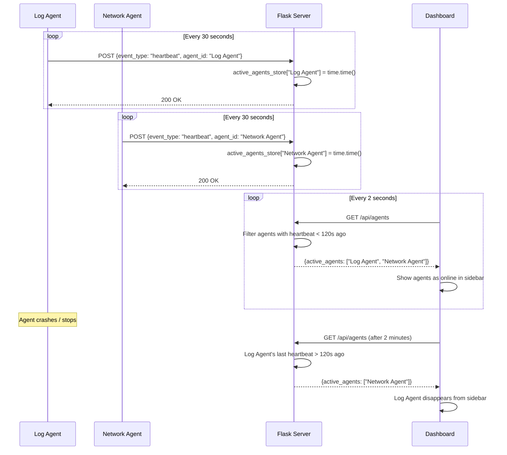
```mermaid
sequenceDiagram
    participant LA as Log Agent
    participant NA as Network Agent
    participant SRV as Flask Server
    participant UI as Dashboard

    loop Every 30 seconds
        LA->>SRV: POST {event_type: "heartbeat", agent_id: "Log Agent"}
        SRV->>SRV: active_agents_store["Log Agent"] = time.time()
        SRV-->>LA: 200 OK
    end

    loop Every 30 seconds
        NA->>SRV: POST {event_type: "heartbeat", agent_id: "Network Agent"}
        SRV->>SRV: active_agents_store["Network Agent"] = time.time()
        SRV-->>NA: 200 OK
    end

    loop Every 2 seconds
        UI->>SRV: GET /api/agents
        SRV->>SRV: Filter agents with heartbeat < 120s ago
        SRV-->>UI: {active_agents: ["Log Agent", "Network Agent"]}
        UI->>UI: Show agents as online in sidebar
    end

    Note over LA: Agent crashes / stops

    UI->>SRV: GET /api/agents (after 2 minutes)
    SRV->>SRV: Log Agent's last heartbeat > 120s ago
    SRV-->>UI: {active_agents: ["Network Agent"]}
    UI->>UI: Log Agent disappears from sidebar
```

---

## 7. Activity Diagrams

### 7.1 Log Agent — Main Processing Loop

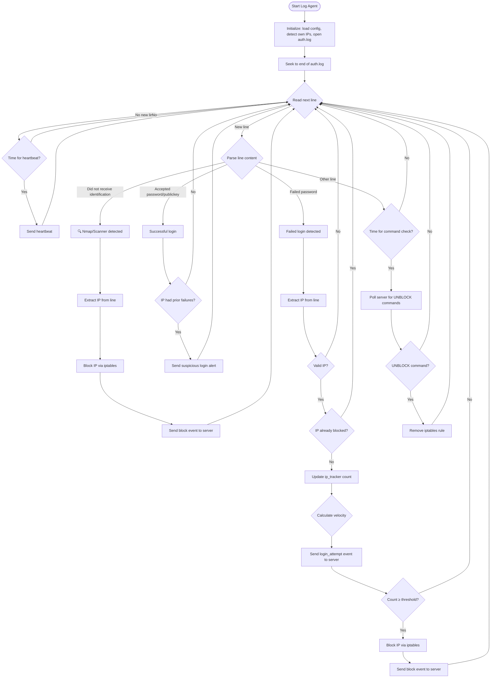
```mermaid
flowchart TD
    START([Start Log Agent]) --> INIT[Initialize: load config, detect own IPs, open auth.log]
    INIT --> SEEK[Seek to end of auth.log]
    SEEK --> READ{Read next line}

    READ -->|No new line| IDLE{Time for heartbeat?}
    IDLE -->|Yes| HB[Send heartbeat]
    IDLE -->|No| READ
    HB --> READ

    READ -->|New line| PARSE{Parse line content}

    PARSE -->|"Did not receive identification"| NMAP[🔍 Nmap/Scanner detected]
    NMAP --> EXTRACT_IP1[Extract IP from line]
    EXTRACT_IP1 --> BLOCK1[Block IP via iptables]
    BLOCK1 --> SEND_BLOCK1[Send block event to server]
    SEND_BLOCK1 --> READ

    PARSE -->|"Accepted password/publickey"| SUCC[Successful login]
    SUCC --> CHECK_PRIOR{IP had prior failures?}
    CHECK_PRIOR -->|Yes| SUSPICIOUS[Send suspicious login alert]
    CHECK_PRIOR -->|No| READ
    SUSPICIOUS --> READ

    PARSE -->|"Failed password"| FAIL[Failed login detected]
    FAIL --> EXTRACT_IP2[Extract IP from line]
    EXTRACT_IP2 --> VALID{Valid IP?}
    VALID -->|No| READ
    VALID -->|Yes| ALREADY_BLOCKED{IP already blocked?}
    ALREADY_BLOCKED -->|Yes| READ
    ALREADY_BLOCKED -->|No| UPDATE[Update ip_tracker count]
    UPDATE --> VELOCITY{Calculate velocity}
    VELOCITY --> SEND_EVENT[Send login_attempt event to server]
    SEND_EVENT --> THRESHOLD{Count ≥ threshold?}
    THRESHOLD -->|No| READ
    THRESHOLD -->|Yes| BLOCK2[Block IP via iptables]
    BLOCK2 --> SEND_BLOCK2[Send block event to server]
    SEND_BLOCK2 --> READ

    PARSE -->|Other line| CMD_CHECK{Time for command check?}
    CMD_CHECK -->|Yes| POLL[Poll server for UNBLOCK commands]
    POLL --> EXEC{UNBLOCK command?}
    EXEC -->|Yes| UNBLOCK[Remove iptables rule]
    EXEC -->|No| READ
    UNBLOCK --> READ
    CMD_CHECK -->|No| READ
```

### 7.2 Network Agent — Packet Processing

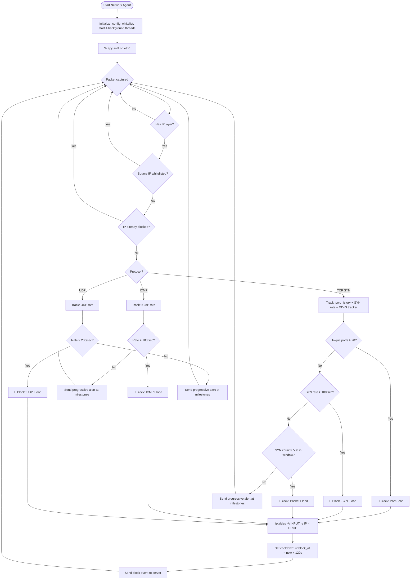
```mermaid
flowchart TD
    START([Start Network Agent]) --> INIT[Initialize: config, whitelist, start 4 background threads]
    INIT --> SNIFF[Scapy sniff on eth0]
    SNIFF --> PKT{Packet captured}

    PKT --> HAS_IP{Has IP layer?}
    HAS_IP -->|No| PKT
    HAS_IP -->|Yes| WL{Source IP whitelisted?}
    WL -->|Yes| PKT
    WL -->|No| BLK{IP already blocked?}
    BLK -->|Yes| PKT
    BLK -->|No| PROTO{Protocol?}

    PROTO -->|TCP SYN| TCP_TRACK[Track: port history + SYN rate + DDoS tracker]
    TCP_TRACK --> PS{Unique ports ≥ 20?}
    PS -->|Yes| BLOCK_PS[🚫 Block: Port Scan]
    PS -->|No| SF{SYN rate ≥ 100/sec?}
    SF -->|Yes| BLOCK_SF[🚫 Block: SYN Flood]
    SF -->|No| PF{SYN count ≥ 500 in window?}
    PF -->|Yes| BLOCK_PF[🚫 Block: Packet Flood]
    PF -->|No| MILESTONE_SYN[Send progressive alert at milestones]
    MILESTONE_SYN --> PKT

    PROTO -->|ICMP| ICMP_TRACK[Track: ICMP rate]
    ICMP_TRACK --> IF{Rate ≥ 100/sec?}
    IF -->|Yes| BLOCK_IF[🚫 Block: ICMP Flood]
    IF -->|No| MILESTONE_ICMP[Send progressive alert at milestones]
    MILESTONE_ICMP --> PKT

    PROTO -->|UDP| UDP_TRACK[Track: UDP rate]
    UDP_TRACK --> UF{Rate ≥ 200/sec?}
    UF -->|Yes| BLOCK_UF[🚫 Block: UDP Flood]
    UF -->|No| MILESTONE_UDP[Send progressive alert at milestones]
    MILESTONE_UDP --> PKT

    BLOCK_PS & BLOCK_SF & BLOCK_PF & BLOCK_IF & BLOCK_UF --> ADD_RULE[iptables -A INPUT -s IP -j DROP]
    ADD_RULE --> SET_COOL[Set cooldown: unblock_at = now + 120s]
    SET_COOL --> SEND_BLOCK[Send block event to server]
    SEND_BLOCK --> PKT
```

### 7.3 Network Agent — Background Threads

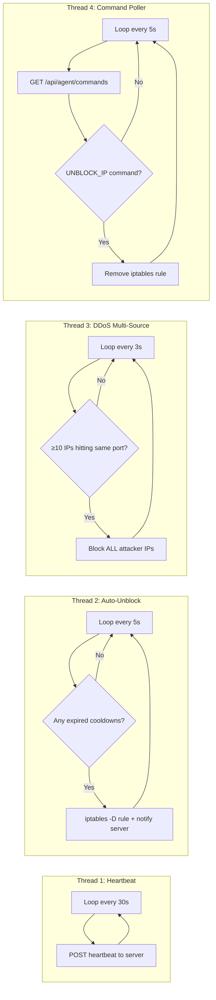
```mermaid
flowchart LR
    subgraph T1["Thread 1: Heartbeat"]
        HB_LOOP[Loop every 30s] --> HB_SEND[POST heartbeat to server]
        HB_SEND --> HB_LOOP
    end

    subgraph T2["Thread 2: Auto-Unblock"]
        UB_LOOP[Loop every 5s] --> UB_CHECK{Any expired cooldowns?}
        UB_CHECK -->|Yes| UB_REMOVE[iptables -D rule + notify server]
        UB_CHECK -->|No| UB_LOOP
        UB_REMOVE --> UB_LOOP
    end

    subgraph T3["Thread 3: DDoS Multi-Source"]
        DD_LOOP[Loop every 3s] --> DD_CHECK{≥10 IPs hitting same port?}
        DD_CHECK -->|Yes| DD_BLOCK[Block ALL attacker IPs]
        DD_CHECK -->|No| DD_LOOP
        DD_BLOCK --> DD_LOOP
    end

    subgraph T4["Thread 4: Command Poller"]
        CP_LOOP[Loop every 5s] --> CP_POLL[GET /api/agent/commands]
        CP_POLL --> CP_CHECK{UNBLOCK_IP command?}
        CP_CHECK -->|Yes| CP_UNBLOCK[Remove iptables rule]
        CP_CHECK -->|No| CP_LOOP
        CP_UNBLOCK --> CP_LOOP
    end
```

---

## 8. State Diagrams

### 8.1 IP Address Lifecycle (Log Agent)

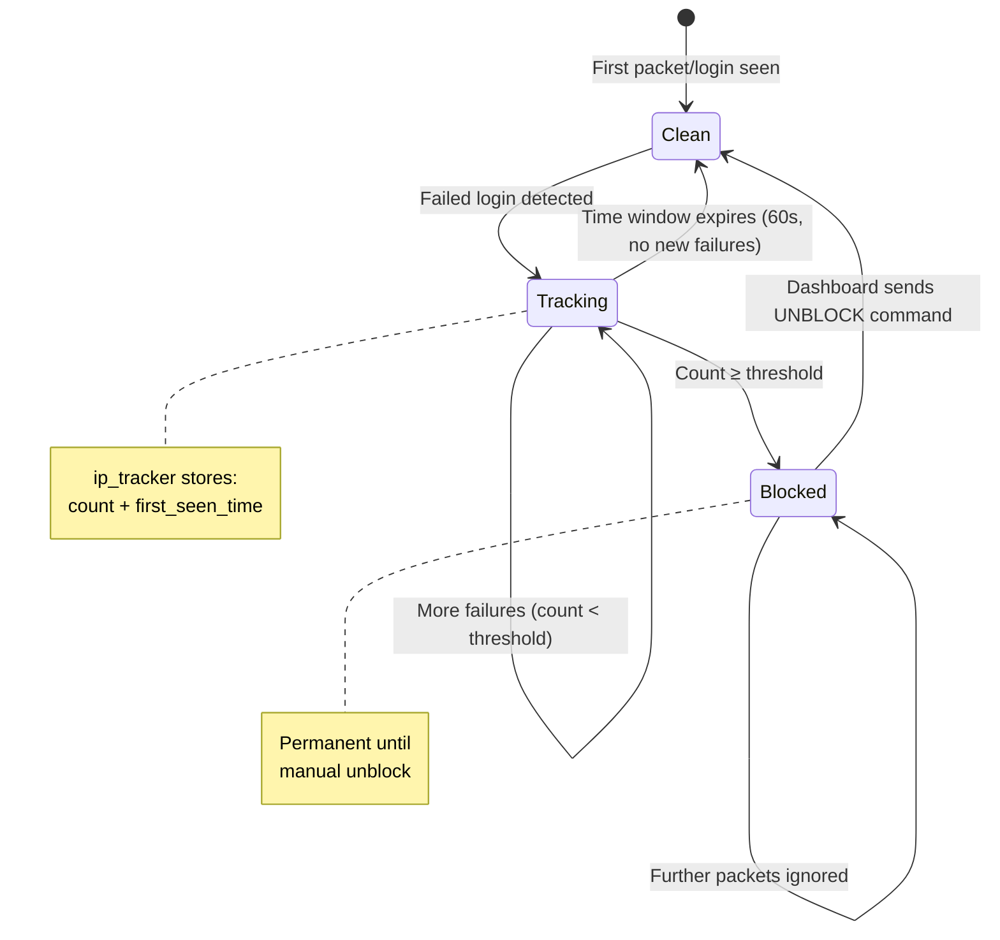
```mermaid
stateDiagram-v2
    [*] --> Clean : First packet/login seen

    Clean --> Tracking : Failed login detected
    Tracking --> Tracking : More failures (count < threshold)
    Tracking --> Clean : Time window expires (60s, no new failures)
    Tracking --> Blocked : Count ≥ threshold

    Blocked --> Clean : Dashboard sends UNBLOCK command
    Blocked --> Blocked : Further packets ignored

    note right of Tracking
        ip_tracker stores:
        count + first_seen_time
    end note

    note right of Blocked
        Permanent until
        manual unblock
    end note
```

### 8.2 IP Address Lifecycle (Network Agent)

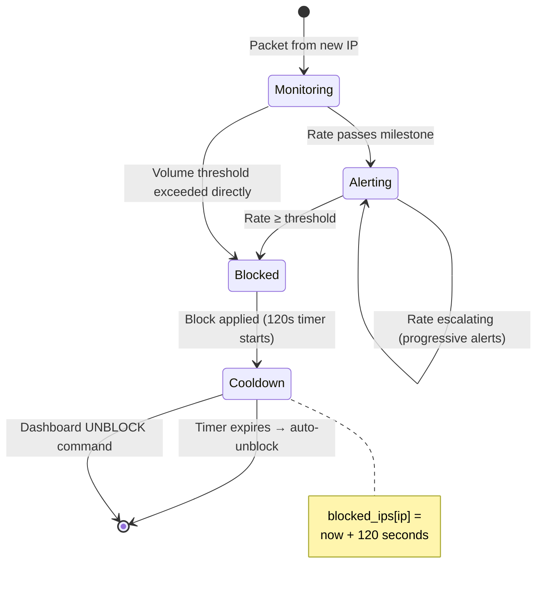
```mermaid
stateDiagram-v2
    [*] --> Monitoring : Packet from new IP

    Monitoring --> Alerting : Rate passes milestone
    Alerting --> Alerting : Rate escalating (progressive alerts)
    Alerting --> Blocked : Rate ≥ threshold

    Monitoring --> Blocked : Volume threshold exceeded directly
    Blocked --> Cooldown : Block applied (120s timer starts)

    Cooldown --> [*] : Timer expires → auto-unblock
    Cooldown --> [*] : Dashboard UNBLOCK command

    note right of Cooldown
        blocked_ips[ip] = 
        now + 120 seconds
    end note
```

### 8.3 Agent Command States

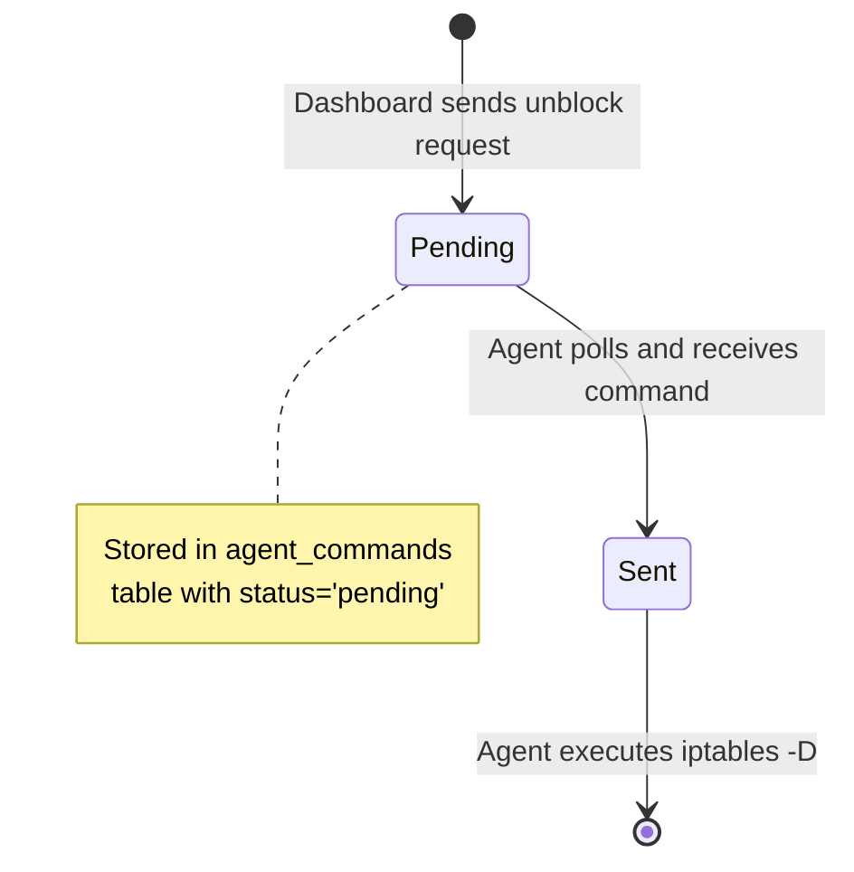
```mermaid
stateDiagram-v2
    [*] --> Pending : Dashboard sends unblock request
    Pending --> Sent : Agent polls and receives command
    Sent --> [*] : Agent executes iptables -D

    note right of Pending
        Stored in agent_commands
        table with status='pending'
    end note
```

---

## 9. Data Flow Diagram

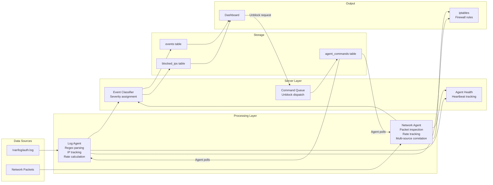
```mermaid
flowchart LR
    subgraph Sources["Data Sources"]
        A1["/var/log/auth.log"]
        A2["Network Packets"]
    end

    subgraph Processing["Processing Layer"]
        B1["Log Agent<br/>Regex parsing<br/>IP tracking<br/>Rate calculation"]
        B2["Network Agent<br/>Packet inspection<br/>Rate tracking<br/>Multi-source correlation"]
    end

    subgraph Server["Server Layer"]
        C1["Event Classifier<br/>Severity assignment"]
        C2["Agent Health<br/>Heartbeat tracking"]
        C3["Command Queue<br/>Unblock dispatch"]
    end

    subgraph Storage["Storage"]
        D1["events table"]
        D2["blocked_ips table"]
        D3["agent_commands table"]
    end

    subgraph Output["Output"]
        E1["Dashboard"]
        E2["iptables<br/>Firewall rules"]
    end

    A1 --> B1
    A2 --> B2
    B1 --> C1
    B2 --> C1
    B1 --> C2
    B2 --> C2
    C1 --> D1
    C1 --> D2
    C3 --> D3
    D1 & D2 --> E1
    B1 & B2 --> E2
    E1 -->|"Unblock request"| C3
    D3 -->|"Agent polls"| B1 & B2
```

---

## 10. Frontend Component Hierarchy

```mermaid
graph TD
    APP["App.jsx<br/>(State management, data fetching)"]
    APP --> LAYOUT["Layout.jsx<br/>(Page wrapper)"]
    LAYOUT --> SIDEBAR["Sidebar.jsx<br/>(Agent list + navigation)"]
    LAYOUT --> CONTENT["Content Area"]

    CONTENT --> HEADER["Header<br/>(Title + connection status)"]

    CONTENT --> OVERVIEW["Overview Mode<br/>(no agent selected)"]
    OVERVIEW --> STATGRID["StatGrid.jsx<br/>(Status cards)"]
    OVERVIEW --> EVENTLOG1["EventLog.jsx<br/>(Live event feed)"]
    OVERVIEW --> CHART["ActivityChart.jsx<br/>(Metrics chart)"]
    OVERVIEW --> BLOCKED1["BlockedList.jsx<br/>(Blocked IPs)"]

    CONTENT --> AGENT_VIEW["Agent View Mode<br/>(agent selected)"]
    AGENT_VIEW --> EVENTLOG2["EventLog.jsx<br/>(Filtered by agent)"]
    AGENT_VIEW --> BLOCKED2["BlockedList.jsx<br/>(Filtered by agent)"]

    style OVERVIEW fill:#1a3a2a
    style AGENT_VIEW fill:#3a1a2a
```

---

## 11. Threat Detection Summary

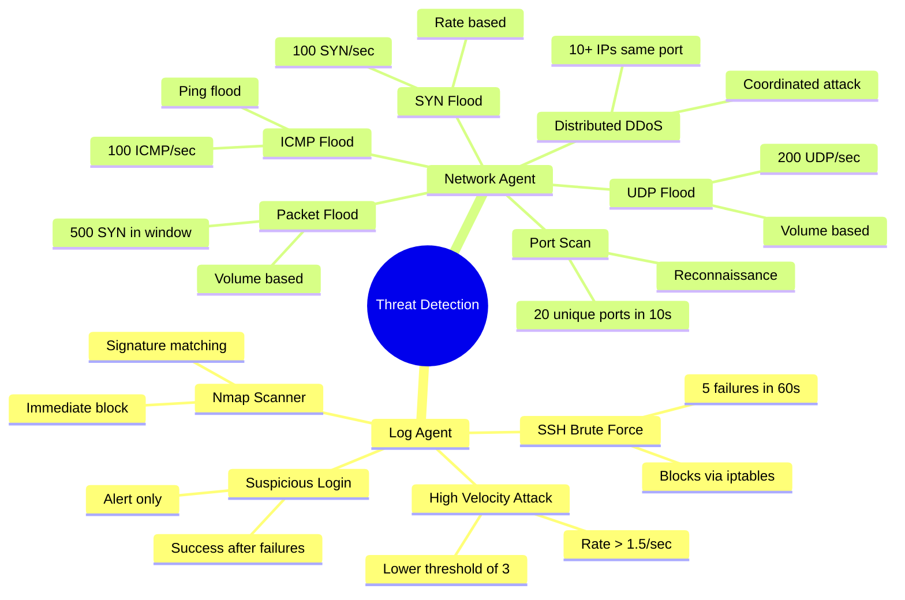
```mermaid
mindmap
    root((Threat Detection))
        Log Agent
            SSH Brute Force
                5 failures in 60s
                Blocks via iptables
            High Velocity Attack
                Rate > 1.5/sec
                Lower threshold of 3
            Nmap Scanner
                Signature matching
                Immediate block
            Suspicious Login
                Success after failures
                Alert only
        Network Agent
            SYN Flood
                100 SYN/sec
                Rate based
            ICMP Flood
                100 ICMP/sec
                Ping flood
            UDP Flood
                200 UDP/sec
                Volume based
            Port Scan
                20 unique ports in 10s
                Reconnaissance
            Distributed DDoS
                10+ IPs same port
                Coordinated attack
            Packet Flood
                500 SYN in window
                Volume based
```

---

## 12. Technology Stack Mapping

| Layer | Technology | Purpose |
|-------|-----------|---------|
| **Presentation** | React 18, Vite | Single-page dashboard UI |
| **API** | Flask, Flask-CORS | RESTful API with CORS support |
| **Detection** | Python, Scapy, Regex | Packet sniffing + log parsing |
| **Storage** | SQLite | Event, blocked IP, and command storage |
| **Response** | iptables / ip6tables | Linux kernel-level packet filtering |
| **Communication** | HTTP/REST (JSON) | Agent ↔ Server, Dashboard ↔ Server |
| **Monitoring** | psutil | CPU/memory stats in heartbeats |

---

## 13. Security Considerations

| Concern | Mitigation |
|---------|-----------|
| Blocking own machine | Protected IPs list + auto-detect own IPs |
| Blocking localhost | 127.0.0.0/8 and ::1 always whitelisted |
| Alert spam | `alerted_ips` set prevents duplicate alerts |
| Permanent lockout | Network Agent auto-unblocks after 120s; Dashboard has manual unblock |
| Log rotation | Log Agent detects inode changes and reopens file |
| Agent crash | Heartbeat timeout (120s) shows agent as offline on dashboard |
| iptables rule duplicates | `iptables -C` check before adding rules |
| Memory leaks | Periodic tracker cleanup for stale IP entries |
