# DFD, ER & Sequence Diagrams

## Agent-Based Intelligent Threat Detection & Response System

---

# Part 1 — Data Flow Diagrams (DFD)

---

## DFD Level 0 — Context Diagram

Shows the entire system as a single process with external entities.

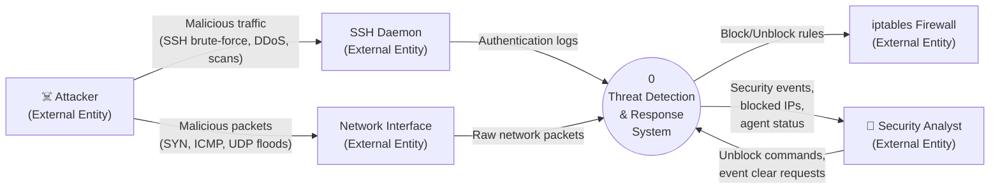
```mermaid
flowchart LR
    ATK["☠️ Attacker<br/>(External Entity)"]
    ANALYST["👤 Security Analyst<br/>(External Entity)"]
    SSHD["SSH Daemon<br/>(External Entity)"]
    NIC["Network Interface<br/>(External Entity)"]
    FW["iptables Firewall<br/>(External Entity)"]

    SYS(("0<br/>Threat Detection<br/>& Response<br/>System"))

    ATK -->|"Malicious traffic<br/>(SSH brute-force, DDoS, scans)"| SSHD
    ATK -->|"Malicious packets<br/>(SYN, ICMP, UDP floods)"| NIC
    SSHD -->|"Authentication logs"| SYS
    NIC -->|"Raw network packets"| SYS
    SYS -->|"Block/Unblock rules"| FW
    SYS -->|"Security events,<br/>blocked IPs,<br/>agent status"| ANALYST
    ANALYST -->|"Unblock commands,<br/>event clear requests"| SYS
```

---

## DFD Level 1 — System Decomposition

Breaks the system into its 4 major processes.

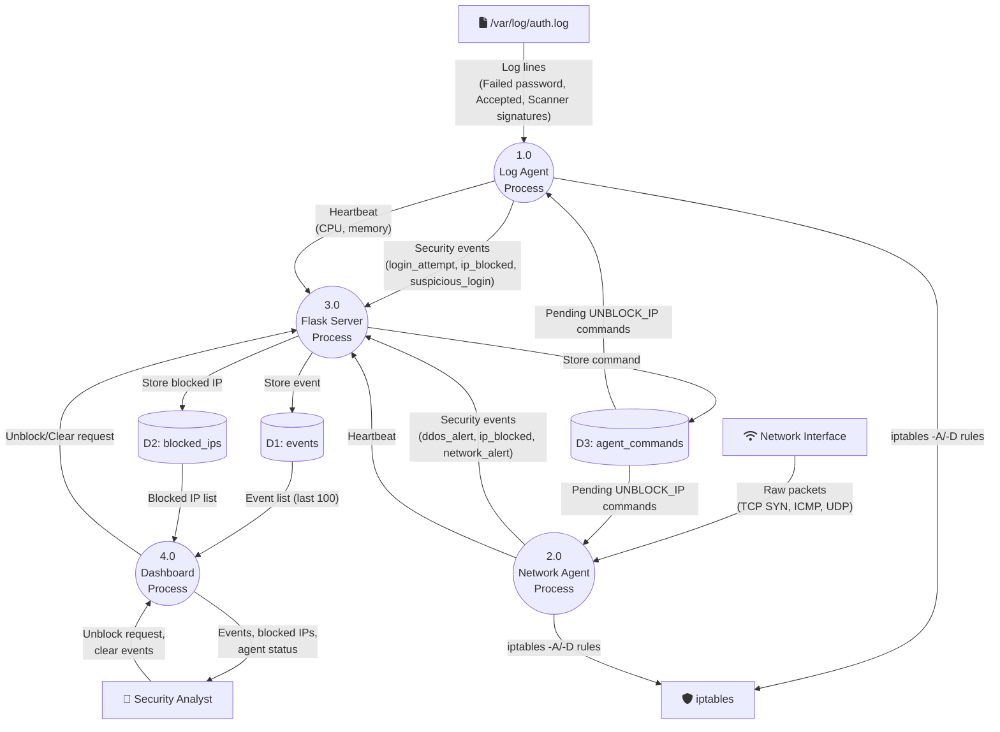
```mermaid
flowchart TB
    %% External Entities
    AUTHLOG["fa:fa-file /var/log/auth.log"]
    NIC["fa:fa-wifi Network Interface"]
    ANALYST["👤 Security Analyst"]
    FW["fa:fa-shield iptables"]

    %% Processes
    P1(("1.0<br/>Log Agent<br/>Process"))
    P2(("2.0<br/>Network Agent<br/>Process"))
    P3(("3.0<br/>Flask Server<br/>Process"))
    P4(("4.0<br/>Dashboard<br/>Process"))

    %% Data Stores
    D1[("D1: events")]
    D2[("D2: blocked_ips")]
    D3[("D3: agent_commands")]

    %% Data Flows
    AUTHLOG -->|"Log lines<br/>(Failed password, Accepted, Scanner signatures)"| P1
    NIC -->|"Raw packets<br/>(TCP SYN, ICMP, UDP)"| P2

    P1 -->|"Security events<br/>(login_attempt, ip_blocked, suspicious_login)"| P3
    P2 -->|"Security events<br/>(ddos_alert, ip_blocked, network_alert)"| P3
    P1 -->|"Heartbeat<br/>(CPU, memory)"| P3
    P2 -->|"Heartbeat"| P3

    P3 -->|"Store event"| D1
    P3 -->|"Store blocked IP"| D2
    P3 -->|"Store command"| D3

    D3 -->|"Pending UNBLOCK_IP commands"| P1
    D3 -->|"Pending UNBLOCK_IP commands"| P2

    D1 -->|"Event list (last 100)"| P4
    D2 -->|"Blocked IP list"| P4

    P4 -->|"Events, blocked IPs,<br/>agent status"| ANALYST
    ANALYST -->|"Unblock request,<br/>clear events"| P4
    P4 -->|"Unblock/Clear request"| P3

    P1 -->|"iptables -A/-D rules"| FW
    P2 -->|"iptables -A/-D rules"| FW
```

---

## DFD Level 2 — Log Agent Decomposition (Process 1.0)

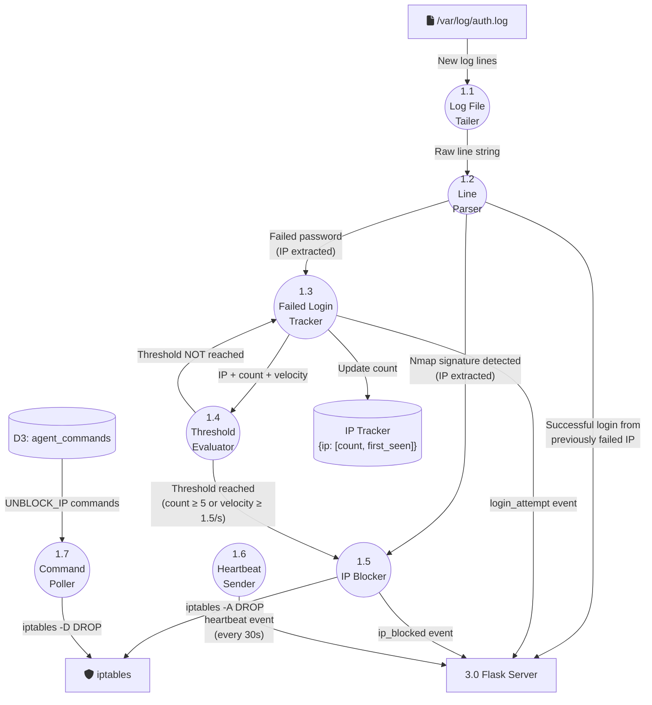
```mermaid
flowchart TB
    %% External
    AUTHLOG["fa:fa-file /var/log/auth.log"]
    FW["fa:fa-shield iptables"]
    SERVER["3.0 Flask Server"]
    D3[("D3: agent_commands")]

    %% Sub-processes
    P1_1(("1.1<br/>Log File<br/>Tailer"))
    P1_2(("1.2<br/>Line<br/>Parser"))
    P1_3(("1.3<br/>Failed Login<br/>Tracker"))
    P1_4(("1.4<br/>Threshold<br/>Evaluator"))
    P1_5(("1.5<br/>IP Blocker"))
    P1_6(("1.6<br/>Heartbeat<br/>Sender"))
    P1_7(("1.7<br/>Command<br/>Poller"))

    %% Internal Store
    DS1[("IP Tracker<br/>{ip: [count, first_seen]}")]

    %% Flows
    AUTHLOG -->|"New log lines"| P1_1
    P1_1 -->|"Raw line string"| P1_2

    P1_2 -->|"Nmap signature detected<br/>(IP extracted)"| P1_5
    P1_2 -->|"Successful login from<br/>previously failed IP"| SERVER
    P1_2 -->|"Failed password<br/>(IP extracted)"| P1_3

    P1_3 -->|"Update count"| DS1
    P1_3 -->|"IP + count + velocity"| P1_4
    P1_3 -->|"login_attempt event"| SERVER

    P1_4 -->|"Threshold NOT reached"| P1_3
    P1_4 -->|"Threshold reached<br/>(count ≥ 5 or velocity ≥ 1.5/s)"| P1_5

    P1_5 -->|"iptables -A DROP"| FW
    P1_5 -->|"ip_blocked event"| SERVER

    P1_6 -->|"heartbeat event<br/>(every 30s)"| SERVER

    D3 -->|"UNBLOCK_IP commands"| P1_7
    P1_7 -->|"iptables -D DROP"| FW
```

---

## DFD Level 2 — Network Agent Decomposition (Process 2.0)

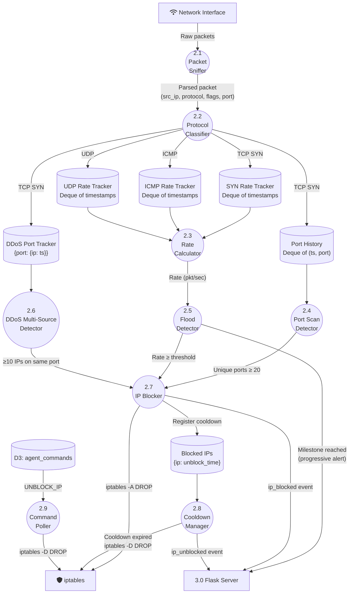
```mermaid
flowchart TB
    %% External
    NIC["fa:fa-wifi Network Interface"]
    FW["fa:fa-shield iptables"]
    SERVER["3.0 Flask Server"]
    D3[("D3: agent_commands")]

    %% Sub-processes
    P2_1(("2.1<br/>Packet<br/>Sniffer"))
    P2_2(("2.2<br/>Protocol<br/>Classifier"))
    P2_3(("2.3<br/>Rate<br/>Calculator"))
    P2_4(("2.4<br/>Port Scan<br/>Detector"))
    P2_5(("2.5<br/>Flood<br/>Detector"))
    P2_6(("2.6<br/>DDoS Multi-Source<br/>Detector"))
    P2_7(("2.7<br/>IP Blocker"))
    P2_8(("2.8<br/>Cooldown<br/>Manager"))
    P2_9(("2.9<br/>Command<br/>Poller"))

    %% Internal Stores
    DS2[("SYN Rate Tracker<br/>Deque of timestamps")]
    DS3[("ICMP Rate Tracker<br/>Deque of timestamps")]
    DS4[("UDP Rate Tracker<br/>Deque of timestamps")]
    DS5[("Port History<br/>Deque of (ts, port)")]
    DS6[("DDoS Port Tracker<br/>{port: {ip: ts}}")]
    DS7[("Blocked IPs<br/>{ip: unblock_time}")]

    %% Flows
    NIC -->|"Raw packets"| P2_1
    P2_1 -->|"Parsed packet<br/>(src_ip, protocol, flags, port)"| P2_2

    P2_2 -->|"TCP SYN"| DS2
    P2_2 -->|"TCP SYN"| DS5
    P2_2 -->|"TCP SYN"| DS6
    P2_2 -->|"ICMP"| DS3
    P2_2 -->|"UDP"| DS4

    DS2 --> P2_3
    DS3 --> P2_3
    DS4 --> P2_3
    P2_3 -->|"Rate (pkt/sec)"| P2_5

    DS5 --> P2_4
    P2_4 -->|"Unique ports ≥ 20"| P2_7

    P2_5 -->|"Rate ≥ threshold"| P2_7
    P2_5 -->|"Milestone reached<br/>(progressive alert)"| SERVER

    DS6 --> P2_6
    P2_6 -->|"≥10 IPs on same port"| P2_7

    P2_7 -->|"iptables -A DROP"| FW
    P2_7 -->|"ip_blocked event"| SERVER
    P2_7 -->|"Register cooldown"| DS7

    DS7 --> P2_8
    P2_8 -->|"Cooldown expired<br/>iptables -D DROP"| FW
    P2_8 -->|"ip_unblocked event"| SERVER

    D3 -->|"UNBLOCK_IP"| P2_9
    P2_9 -->|"iptables -D DROP"| FW
```

---

## DFD Level 2 — Flask Server Decomposition (Process 3.0)

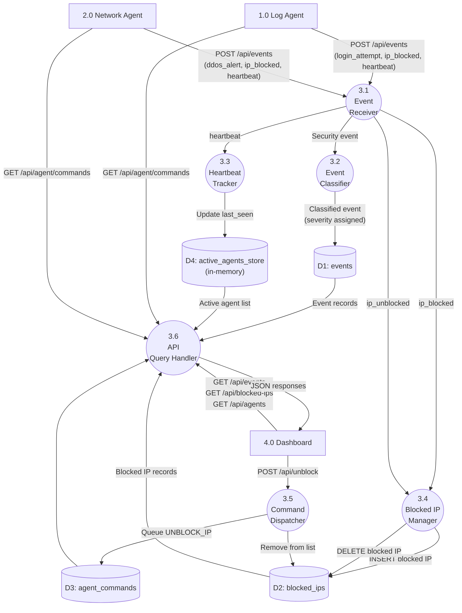
```mermaid
flowchart TB
    %% External
    LA["1.0 Log Agent"]
    NA["2.0 Network Agent"]
    DASH["4.0 Dashboard"]

    %% Sub-processes
    P3_1(("3.1<br/>Event<br/>Receiver"))
    P3_2(("3.2<br/>Event<br/>Classifier"))
    P3_3(("3.3<br/>Heartbeat<br/>Tracker"))
    P3_4(("3.4<br/>Blocked IP<br/>Manager"))
    P3_5(("3.5<br/>Command<br/>Dispatcher"))
    P3_6(("3.6<br/>API<br/>Query Handler"))

    %% Data Stores
    D1[("D1: events")]
    D2[("D2: blocked_ips")]
    D3[("D3: agent_commands")]
    D4[("D4: active_agents_store<br/>(in-memory)")]

    %% Flows
    LA -->|"POST /api/events<br/>(login_attempt, ip_blocked, heartbeat)"| P3_1
    NA -->|"POST /api/events<br/>(ddos_alert, ip_blocked, heartbeat)"| P3_1

    P3_1 -->|"heartbeat"| P3_3
    P3_3 -->|"Update last_seen"| D4

    P3_1 -->|"Security event"| P3_2
    P3_2 -->|"Classified event<br/>(severity assigned)"| D1

    P3_1 -->|"ip_blocked"| P3_4
    P3_4 -->|"INSERT blocked IP"| D2
    P3_1 -->|"ip_unblocked"| P3_4
    P3_4 -->|"DELETE blocked IP"| D2

    DASH -->|"POST /api/unblock"| P3_5
    P3_5 -->|"Queue UNBLOCK_IP"| D3
    P3_5 -->|"Remove from list"| D2

    DASH -->|"GET /api/events<br/>GET /api/blocked-ips<br/>GET /api/agents"| P3_6
    D1 -->|"Event records"| P3_6
    D2 -->|"Blocked IP records"| P3_6
    D4 -->|"Active agent list"| P3_6
    P3_6 -->|"JSON responses"| DASH

    LA -->|"GET /api/agent/commands"| P3_6
    NA -->|"GET /api/agent/commands"| P3_6
    D3 --> P3_6
```

---

# Part 2 — Entity-Relationship Diagrams

---

## ER Diagram — Full Database Schema

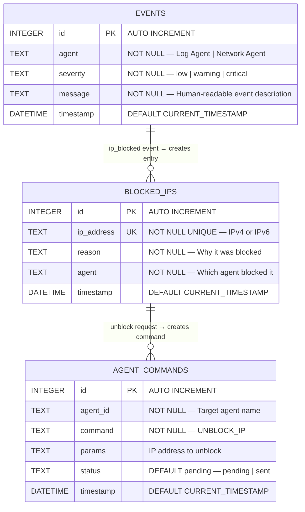
```mermaid
erDiagram
    EVENTS {
        INTEGER id PK "AUTO INCREMENT"
        TEXT agent "NOT NULL — Log Agent | Network Agent"
        TEXT severity "NOT NULL — low | warning | critical"
        TEXT message "NOT NULL — Human-readable event description"
        DATETIME timestamp "DEFAULT CURRENT_TIMESTAMP"
    }

    BLOCKED_IPS {
        INTEGER id PK "AUTO INCREMENT"
        TEXT ip_address UK "NOT NULL UNIQUE — IPv4 or IPv6"
        TEXT reason "NOT NULL — Why it was blocked"
        TEXT agent "NOT NULL — Which agent blocked it"
        DATETIME timestamp "DEFAULT CURRENT_TIMESTAMP"
    }

    AGENT_COMMANDS {
        INTEGER id PK "AUTO INCREMENT"
        TEXT agent_id "NOT NULL — Target agent name"
        TEXT command "NOT NULL — UNBLOCK_IP"
        TEXT params "IP address to unblock"
        TEXT status "DEFAULT pending — pending | sent"
        DATETIME timestamp "DEFAULT CURRENT_TIMESTAMP"
    }

    EVENTS ||--o{ BLOCKED_IPS : "ip_blocked event → creates entry"
    BLOCKED_IPS ||--o{ AGENT_COMMANDS : "unblock request → creates command"
```

---

## ER Diagram — Data Dictionary

### Events Table

| Column | Type | Constraint | Description | Example Values |
|--------|------|-----------|-------------|----------------|
| `id` | INTEGER | PK, AUTO INCREMENT | Unique event ID | 1, 2, 3, ... |
| `agent` | TEXT | NOT NULL | Agent that generated the event | `"Log Agent"`, `"Network Agent"` |
| `severity` | TEXT | NOT NULL | Threat severity level | `"low"`, `"warning"`, `"critical"` |
| `message` | TEXT | NOT NULL | Human-readable description | `"Failed Login: 3/5 attempts from 10.0.0.5"` |
| `timestamp` | DATETIME | DEFAULT CURRENT_TIMESTAMP | When the event was created | `"2026-02-25 03:30:00"` |

### Blocked IPs Table

| Column | Type | Constraint | Description | Example Values |
|--------|------|-----------|-------------|----------------|
| `id` | INTEGER | PK, AUTO INCREMENT | Unique record ID | 1, 2, 3, ... |
| `ip_address` | TEXT | NOT NULL, UNIQUE | Blocked IP address | `"10.0.0.5"`, `"2001:db8::1"` |
| `reason` | TEXT | NOT NULL | Why the IP was blocked | `"Exceeded 5 failed login attempts"` |
| `agent` | TEXT | NOT NULL | Which agent blocked it | `"Log Agent"`, `"Network Agent"` |
| `timestamp` | DATETIME | DEFAULT CURRENT_TIMESTAMP | When the IP was blocked | `"2026-02-25 03:30:00"` |

### Agent Commands Table

| Column | Type | Constraint | Description | Example Values |
|--------|------|-----------|-------------|----------------|
| `id` | INTEGER | PK, AUTO INCREMENT | Unique command ID | 1, 2, 3, ... |
| `agent_id` | TEXT | NOT NULL | Target agent for the command | `"Log Agent"`, `"Network Agent"` |
| `command` | TEXT | NOT NULL | Command type | `"UNBLOCK_IP"` |
| `params` | TEXT | — | Command parameter | `"10.0.0.5"` |
| `status` | TEXT | DEFAULT 'pending' | Execution state | `"pending"`, `"sent"` |
| `timestamp` | DATETIME | DEFAULT CURRENT_TIMESTAMP | When the command was created | `"2026-02-25 03:35:00"` |

---

## ER Diagram — Relationship Mapping

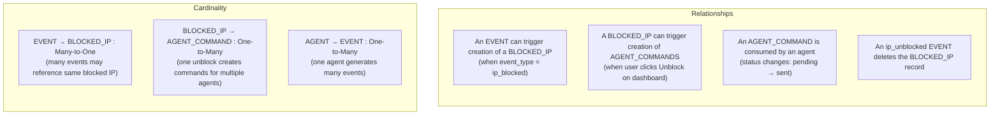
```mermaid
flowchart TB
    subgraph Relationships
        direction TB
        R1["An EVENT can trigger creation of a BLOCKED_IP<br/>(when event_type = ip_blocked)"]
        R2["A BLOCKED_IP can trigger creation of AGENT_COMMANDS<br/>(when user clicks Unblock on dashboard)"]
        R3["An AGENT_COMMAND is consumed by an agent<br/>(status changes: pending → sent)"]
        R4["An ip_unblocked EVENT deletes the BLOCKED_IP record"]
    end

    subgraph Cardinality
        direction TB
        C1["EVENT → BLOCKED_IP : Many-to-One<br/>(many events may reference same blocked IP)"]
        C2["BLOCKED_IP → AGENT_COMMAND : One-to-Many<br/>(one unblock creates commands for multiple agents)"]
        C3["AGENT → EVENT : One-to-Many<br/>(one agent generates many events)"]
    end
```

---

# Part 3 — Sequence Diagrams

---

## SD-1: System Startup Sequence

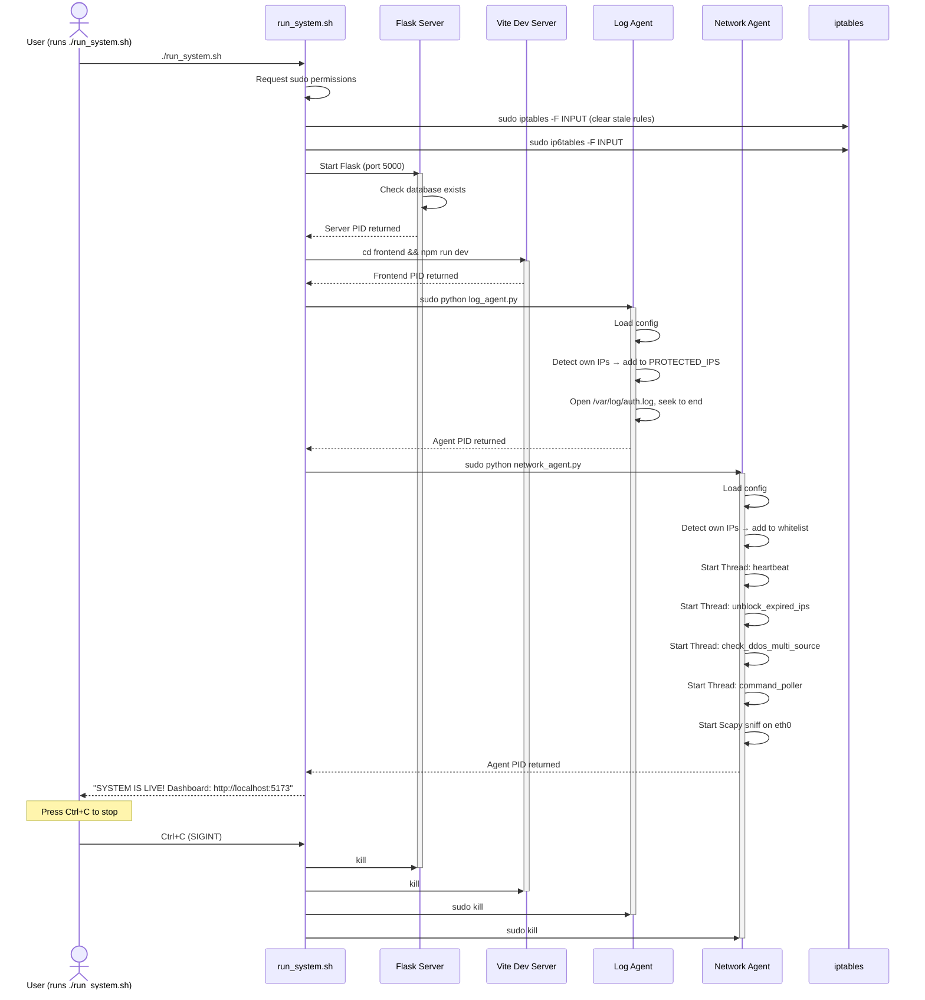
```mermaid
sequenceDiagram
    actor User as User (runs ./run_system.sh)
    participant SH as run_system.sh
    participant FLASK as Flask Server
    participant VITE as Vite Dev Server
    participant LA as Log Agent
    participant NA as Network Agent
    participant FW as iptables

    User->>SH: ./run_system.sh
    SH->>SH: Request sudo permissions
    SH->>FW: sudo iptables -F INPUT (clear stale rules)
    SH->>FW: sudo ip6tables -F INPUT

    SH->>FLASK: Start Flask (port 5000)
    activate FLASK
    FLASK->>FLASK: Check database exists
    FLASK-->>SH: Server PID returned

    SH->>VITE: cd frontend && npm run dev
    activate VITE
    VITE-->>SH: Frontend PID returned

    SH->>LA: sudo python log_agent.py
    activate LA
    LA->>LA: Load config
    LA->>LA: Detect own IPs → add to PROTECTED_IPS
    LA->>LA: Open /var/log/auth.log, seek to end
    LA-->>SH: Agent PID returned

    SH->>NA: sudo python network_agent.py
    activate NA
    NA->>NA: Load config
    NA->>NA: Detect own IPs → add to whitelist
    NA->>NA: Start Thread: heartbeat
    NA->>NA: Start Thread: unblock_expired_ips
    NA->>NA: Start Thread: check_ddos_multi_source
    NA->>NA: Start Thread: command_poller
    NA->>NA: Start Scapy sniff on eth0
    NA-->>SH: Agent PID returned

    SH-->>User: "SYSTEM IS LIVE! Dashboard: http://localhost:5173"
    Note over User: Press Ctrl+C to stop
    User->>SH: Ctrl+C (SIGINT)
    SH->>FLASK: kill
    deactivate FLASK
    SH->>VITE: kill
    deactivate VITE
    SH->>LA: sudo kill
    deactivate LA
    SH->>NA: sudo kill
    deactivate NA
```

---

## SD-2: SSH Brute-Force Attack — Full Flow (Log Agent)

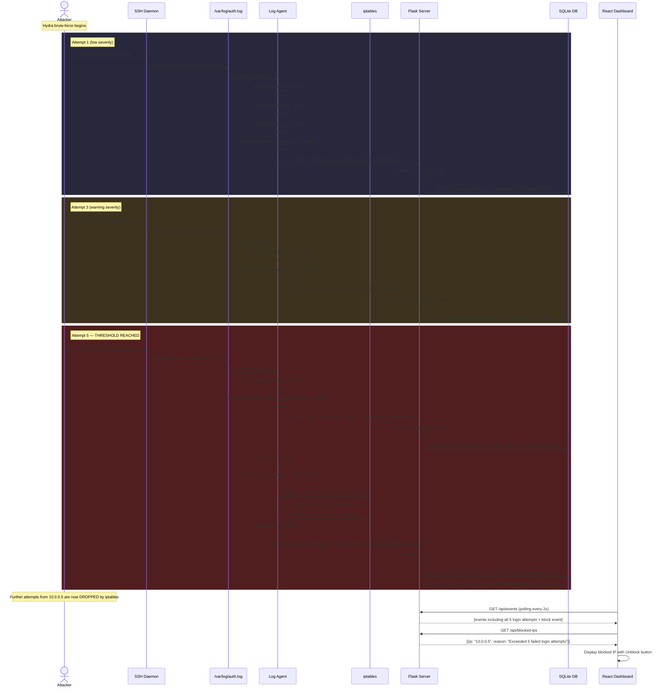
```mermaid
sequenceDiagram
    actor Attacker
    participant SSH as SSH Daemon
    participant AUTH as /var/log/auth.log
    participant LA as Log Agent
    participant IPT as iptables
    participant SRV as Flask Server
    participant DB as SQLite DB
    participant UI as React Dashboard

    Note over Attacker: Hydra brute-force begins

    rect rgb(40, 40, 60)
        Note right of Attacker: Attempt 1 (low severity)
        Attacker->>SSH: SSH login (wrong password)
        SSH->>AUTH: "Failed password for haja from 10.0.0.5"
        AUTH->>LA: follow() yields line
        LA->>LA: Regex extracts IP: 10.0.0.5
        LA->>LA: is_valid_ip(10.0.0.5) → true
        LA->>LA: ip_tracker[10.0.0.5] = [1, now]
        LA->>LA: Velocity check: only 1 attempt → not critical
        LA->>SRV: POST {event_type: "login_attempt", count: 1, threshold: 5}
        SRV->>SRV: severity = "low" (1/5 = 0.2)
        SRV->>DB: INSERT events (Log Agent, low, "Failed Login: 1/5 from 10.0.0.5")
    end

    rect rgb(60, 50, 30)
        Note right of Attacker: Attempt 3 (warning severity)
        Attacker->>SSH: SSH login (wrong password)
        SSH->>AUTH: "Failed password for haja from 10.0.0.5"
        AUTH->>LA: follow() yields line
        LA->>LA: ip_tracker[10.0.0.5] = [3, first_seen]
        LA->>LA: Velocity: 3 attempts / elapsed time → check rate
        LA->>SRV: POST {event_type: "login_attempt", count: 3, threshold: 5}
        SRV->>SRV: severity = "warning" (3/5 = 0.6)
        SRV->>DB: INSERT events (Log Agent, warning, "Failed Login: 3/5 from 10.0.0.5")
    end

    rect rgb(80, 30, 30)
        Note right of Attacker: Attempt 5 — THRESHOLD REACHED
        Attacker->>SSH: SSH login (wrong password)
        SSH->>AUTH: "Failed password for haja from 10.0.0.5"
        AUTH->>LA: follow() yields line
        LA->>LA: ip_tracker[10.0.0.5] = [5, first_seen]
        LA->>LA: count (5) ≥ BRUTE_FORCE_THRESHOLD (5) → BLOCK!
        LA->>SRV: POST {event_type: "login_attempt", count: 5, threshold: 5, is_critical: false}
        SRV->>SRV: severity = "critical" (5/5 = 1.0)
        SRV->>DB: INSERT events (Log Agent, critical, "Failed Login: 5/5 [Threshold Reached]")

        LA->>LA: block_ip("10.0.0.5")
        LA->>LA: PROTECTED_IPS check → not protected
        LA->>IPT: iptables -C INPUT -s 10.0.0.5 -j DROP (check)
        IPT-->>LA: returncode ≠ 0 (not yet blocked)
        LA->>IPT: iptables -A INPUT -s 10.0.0.5 -j DROP
        LA->>LA: blocked_ips.add("10.0.0.5")

        LA->>SRV: POST {event_type: "ip_blocked", ip: "10.0.0.5", reason: "Exceeded 5 failed login attempts"}
        SRV->>SRV: severity = "critical"
        SRV->>DB: INSERT events (Log Agent, critical, "ACTIVE RESPONSE: Blocked IP 10.0.0.5")
        SRV->>DB: INSERT blocked_ips (10.0.0.5, "Exceeded 5 failed login attempts", Log Agent)
    end

    Note over Attacker: Further attempts from 10.0.0.5 are now DROPPED by iptables

    UI->>SRV: GET /api/events (polling every 2s)
    SRV-->>UI: [events including all 5 login attempts + block event]
    UI->>SRV: GET /api/blocked-ips
    SRV-->>UI: [{ip: "10.0.0.5", reason: "Exceeded 5 failed login attempts"}]
    UI->>UI: Display blocked IP with Unblock button
```

---

## SD-3: High-Velocity Brute-Force (Hydra Detection)

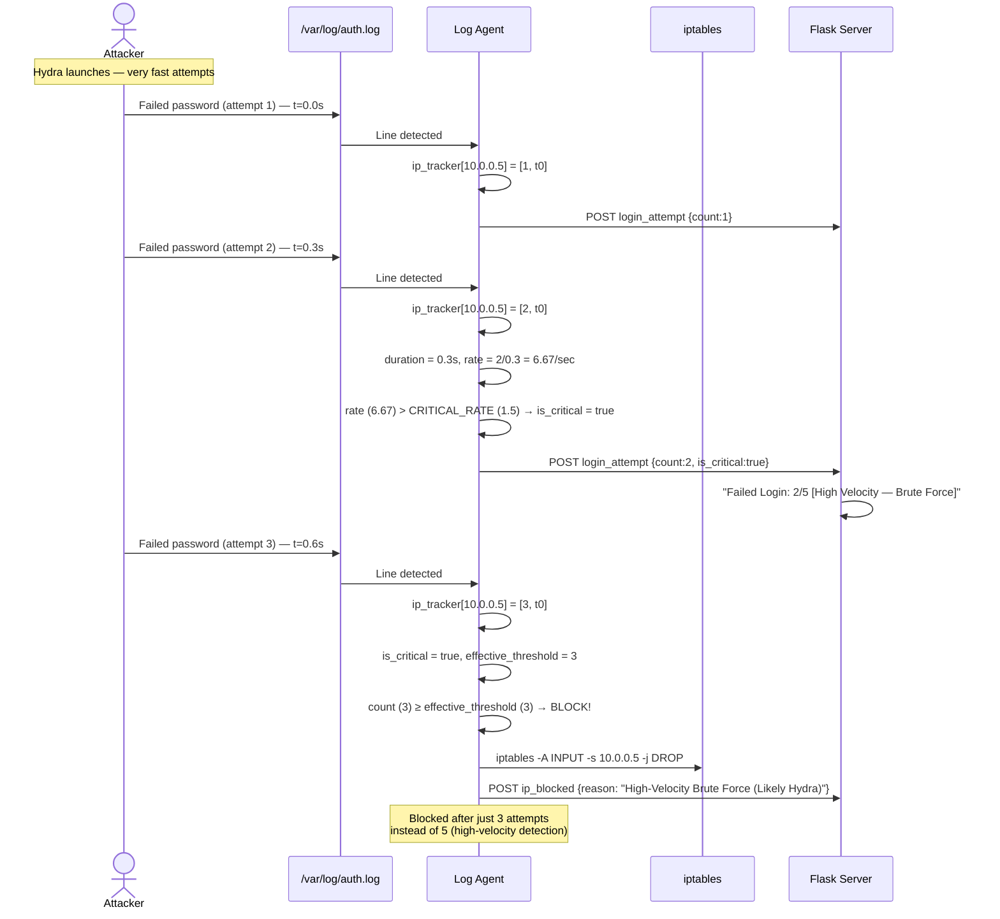
```mermaid
sequenceDiagram
    actor Attacker
    participant AUTH as /var/log/auth.log
    participant LA as Log Agent
    participant IPT as iptables
    participant SRV as Flask Server

    Note over Attacker: Hydra launches — very fast attempts

    Attacker->>AUTH: Failed password (attempt 1) — t=0.0s
    AUTH->>LA: Line detected
    LA->>LA: ip_tracker[10.0.0.5] = [1, t0]
    LA->>SRV: POST login_attempt {count:1}

    Attacker->>AUTH: Failed password (attempt 2) — t=0.3s
    AUTH->>LA: Line detected
    LA->>LA: ip_tracker[10.0.0.5] = [2, t0]
    LA->>LA: duration = 0.3s, rate = 2/0.3 = 6.67/sec
    LA->>LA: rate (6.67) > CRITICAL_RATE (1.5) → is_critical = true
    LA->>SRV: POST login_attempt {count:2, is_critical:true}
    SRV->>SRV: "Failed Login: 2/5 [High Velocity — Brute Force]"

    Attacker->>AUTH: Failed password (attempt 3) — t=0.6s
    AUTH->>LA: Line detected
    LA->>LA: ip_tracker[10.0.0.5] = [3, t0]
    LA->>LA: is_critical = true, effective_threshold = 3
    LA->>LA: count (3) ≥ effective_threshold (3) → BLOCK!
    LA->>IPT: iptables -A INPUT -s 10.0.0.5 -j DROP
    LA->>SRV: POST ip_blocked {reason: "High-Velocity Brute Force (Likely Hydra)"}

    Note over LA: Blocked after just 3 attempts<br/>instead of 5 (high-velocity detection)
```

---

## SD-4: DDoS SYN Flood Detection (Network Agent)

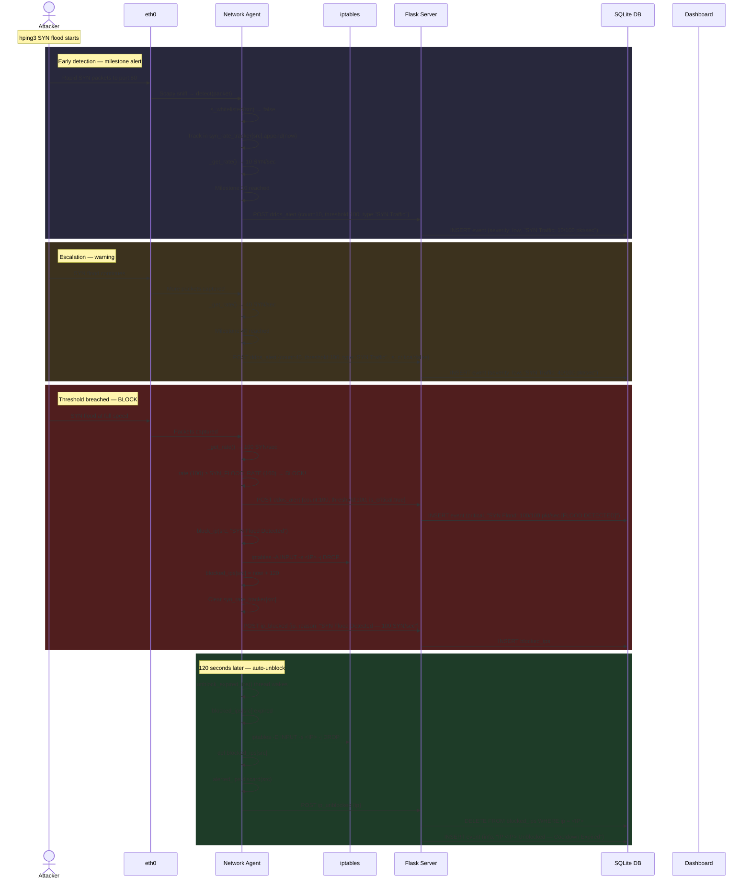
```mermaid
sequenceDiagram
    actor Attacker
    participant NIC as eth0
    participant NA as Network Agent
    participant IPT as iptables
    participant SRV as Flask Server
    participant DB as SQLite DB
    participant UI as Dashboard

    Note over Attacker: hping3 SYN flood starts

    rect rgb(40, 40, 60)
        Note right of Attacker: Early detection — milestone alert
        Attacker->>NIC: Rapid SYN packets to port 80
        NIC->>NA: Scapy sniff → detect(packet)
        NA->>NA: is_whitelisted(src) → false
        NA->>NA: Track in syn_rate_tracker[src].append(now)
        NA->>NA: _get_rate() → 10 SYN/sec
        NA->>NA: Milestone 10 reached
        NA->>SRV: POST ddos_alert {count:10, threshold:100, type:"SYN Traffic"}
        SRV->>DB: INSERT event (severity: low, "SYN Traffic: 10/100 pkt/sec")
    end

    rect rgb(60, 50, 30)
        Note right of Attacker: Escalation — warning
        Attacker->>NIC: SYN flood continues
        NIC->>NA: More packets captured
        NA->>NA: _get_rate() → 40 SYN/sec
        NA->>NA: Milestone 40 reached
        NA->>SRV: POST ddos_alert {count:40, threshold:100, type:"SYN Traffic", is_critical:false}
        SRV->>DB: INSERT event (severity: low, "SYN Traffic: 40/100 pkt/sec")
    end

    rect rgb(80, 30, 30)
        Note right of Attacker: Threshold breached — BLOCK
        Attacker->>NIC: SYN flood at full speed
        NIC->>NA: Packets captured
        NA->>NA: _get_rate() → 100 SYN/sec
        NA->>NA: rate (100) ≥ SYN_FLOOD_RATE (100) → BLOCK!
        NA->>SRV: POST ddos_alert {count:100, threshold:100, is_critical:true}
        SRV->>DB: INSERT event (critical, "SYN Flood: 100/100 pkt/sec [FLOOD DETECTED]")

        NA->>NA: block_ip(src, "SYN Flood Detected")
        NA->>IPT: iptables -A INPUT -s <IP> -j DROP
        NA->>NA: blocked_ips[src] = now + 120
        NA->>NA: Clear syn_rate_tracker[src]
        NA->>SRV: POST ip_blocked {ip, reason: "SYN Flood Detected — 100 SYN/sec"}
        SRV->>DB: INSERT blocked_ips
    end

    rect rgb(30, 60, 40)
        Note over NA: 120 seconds later — auto-unblock
        NA->>NA: unblock_expired_ips() thread wakes
        NA->>NA: blocked_ips[src] expired
        NA->>IPT: iptables -D INPUT -s <IP> -j DROP
        NA->>NA: del blocked_ips[src]
        NA->>NA: alerted_ips.discard(src)
        NA->>SRV: POST ip_unblocked {ip}
        SRV->>DB: DELETE FROM blocked_ips WHERE ip = <IP>
        SRV->>DB: INSERT event (info, "IP <IP> Unblocked — Cooldown Expired")
    end
```

---

## SD-5: Port Scan Detection (Network Agent)

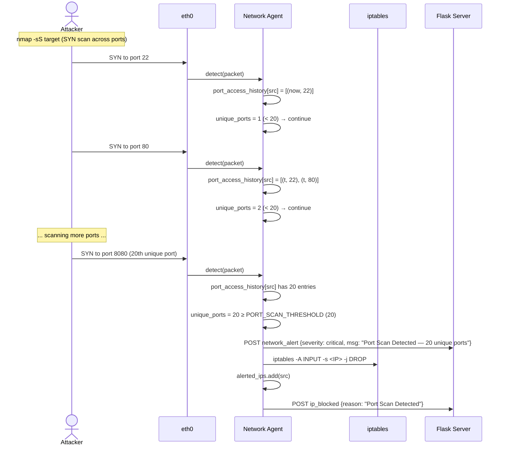
```mermaid
sequenceDiagram
    actor Attacker
    participant NIC as eth0
    participant NA as Network Agent
    participant IPT as iptables
    participant SRV as Flask Server

    Note over Attacker: nmap -sS target (SYN scan across ports)

    Attacker->>NIC: SYN to port 22
    NIC->>NA: detect(packet)
    NA->>NA: port_access_history[src] = [(now, 22)]
    NA->>NA: unique_ports = 1 (< 20) → continue

    Attacker->>NIC: SYN to port 80
    NIC->>NA: detect(packet)
    NA->>NA: port_access_history[src] = [(t, 22), (t, 80)]
    NA->>NA: unique_ports = 2 (< 20) → continue

    Note over Attacker: ... scanning more ports ...

    Attacker->>NIC: SYN to port 8080 (20th unique port)
    NIC->>NA: detect(packet)
    NA->>NA: port_access_history[src] has 20 entries
    NA->>NA: unique_ports = 20 ≥ PORT_SCAN_THRESHOLD (20)

    NA->>SRV: POST network_alert {severity: critical, msg: "Port Scan Detected — 20 unique ports"}
    NA->>IPT: iptables -A INPUT -s <IP> -j DROP
    NA->>NA: alerted_ips.add(src)
    NA->>SRV: POST ip_blocked {reason: "Port Scan Detected"}
```

---

## SD-6: Distributed DDoS Detection (Network Agent)

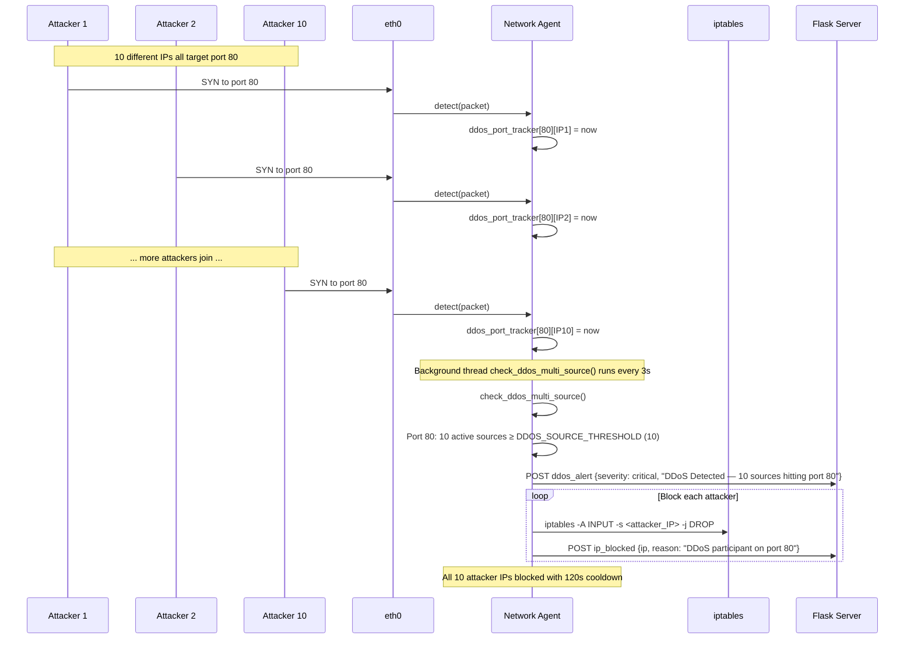
```mermaid
sequenceDiagram
    participant A1 as Attacker 1
    participant A2 as Attacker 2
    participant A10 as Attacker 10
    participant NIC as eth0
    participant NA as Network Agent
    participant IPT as iptables
    participant SRV as Flask Server

    Note over A1,A10: 10 different IPs all target port 80

    A1->>NIC: SYN to port 80
    NIC->>NA: detect(packet)
    NA->>NA: ddos_port_tracker[80][IP1] = now

    A2->>NIC: SYN to port 80
    NIC->>NA: detect(packet)
    NA->>NA: ddos_port_tracker[80][IP2] = now

    Note over A1,A10: ... more attackers join ...

    A10->>NIC: SYN to port 80
    NIC->>NA: detect(packet)
    NA->>NA: ddos_port_tracker[80][IP10] = now

    Note over NA: Background thread check_ddos_multi_source() runs every 3s

    NA->>NA: check_ddos_multi_source()
    NA->>NA: Port 80: 10 active sources ≥ DDOS_SOURCE_THRESHOLD (10)
    NA->>SRV: POST ddos_alert {severity: critical, "DDoS Detected — 10 sources hitting port 80"}

    loop Block each attacker
        NA->>IPT: iptables -A INPUT -s <attacker_IP> -j DROP
        NA->>SRV: POST ip_blocked {ip, reason: "DDoS participant on port 80"}
    end

    Note over NA: All 10 attacker IPs blocked with 120s cooldown
```

---

## SD-7: Dashboard Manual Unblock — Full Chain

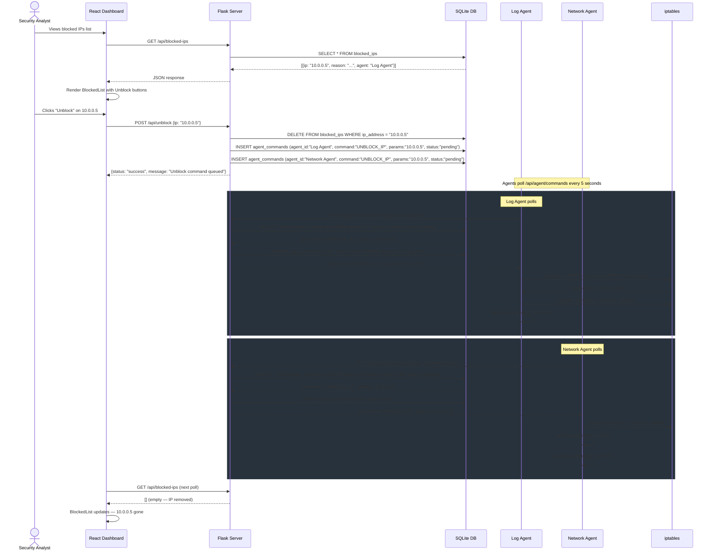
```mermaid
sequenceDiagram
    actor Analyst as Security Analyst
    participant UI as React Dashboard
    participant SRV as Flask Server
    participant DB as SQLite DB
    participant LA as Log Agent
    participant NA as Network Agent
    participant IPT as iptables

    Analyst->>UI: Views blocked IPs list
    UI->>SRV: GET /api/blocked-ips
    SRV->>DB: SELECT * FROM blocked_ips
    DB-->>SRV: [{ip: "10.0.0.5", reason: "...", agent: "Log Agent"}]
    SRV-->>UI: JSON response
    UI->>UI: Render BlockedList with Unblock buttons

    Analyst->>UI: Clicks "Unblock" on 10.0.0.5
    UI->>SRV: POST /api/unblock {ip: "10.0.0.5"}

    SRV->>DB: DELETE FROM blocked_ips WHERE ip_address = "10.0.0.5"
    SRV->>DB: INSERT agent_commands (agent_id:"Log Agent", command:"UNBLOCK_IP", params:"10.0.0.5", status:"pending")
    SRV->>DB: INSERT agent_commands (agent_id:"Network Agent", command:"UNBLOCK_IP", params:"10.0.0.5", status:"pending")
    SRV-->>UI: {status: "success", message: "Unblock command queued"}

    Note over LA,NA: Agents poll /api/agent/commands every 5 seconds

    rect rgb(40, 50, 60)
        Note over LA: Log Agent polls
        LA->>SRV: GET /api/agent/commands?agent_id=Log Agent
        SRV->>DB: SELECT * FROM agent_commands WHERE agent_id="Log Agent" AND status="pending"
        DB-->>SRV: [{command:"UNBLOCK_IP", params:"10.0.0.5"}]
        SRV->>DB: UPDATE agent_commands SET status="sent" WHERE agent_id="Log Agent"
        SRV-->>LA: [{command:"UNBLOCK_IP", params:"10.0.0.5"}]

        LA->>IPT: iptables -C INPUT -s 10.0.0.5 -j DROP (check exists)
        IPT-->>LA: returncode = 0 (rule exists)
        LA->>IPT: iptables -D INPUT -s 10.0.0.5 -j DROP
        LA->>LA: blocked_ips.discard("10.0.0.5")
    end

    rect rgb(40, 50, 60)
        Note over NA: Network Agent polls
        NA->>SRV: GET /api/agent/commands?agent_id=Network Agent
        SRV->>DB: SELECT * FROM agent_commands WHERE agent_id="Network Agent" AND status="pending"
        DB-->>SRV: [{command:"UNBLOCK_IP", params:"10.0.0.5"}]
        SRV->>DB: UPDATE agent_commands SET status="sent"
        SRV-->>NA: [{command:"UNBLOCK_IP", params:"10.0.0.5"}]

        NA->>IPT: iptables -D INPUT -s 10.0.0.5 -j DROP
        NA->>NA: del blocked_ips["10.0.0.5"]
        NA->>NA: alerted_ips.discard("10.0.0.5")
    end

    UI->>SRV: GET /api/blocked-ips (next poll)
    SRV-->>UI: [] (empty — IP removed)
    UI->>UI: BlockedList updates — 10.0.0.5 gone
```

---

## SD-8: Suspicious Login Detection

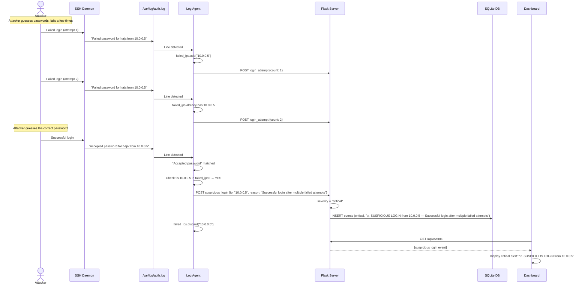
```mermaid
sequenceDiagram
    actor Attacker
    participant SSH as SSH Daemon
    participant AUTH as /var/log/auth.log
    participant LA as Log Agent
    participant SRV as Flask Server
    participant DB as SQLite DB
    participant UI as Dashboard

    Note over Attacker: Attacker guesses passwords, fails a few times

    Attacker->>SSH: Failed login (attempt 1)
    SSH->>AUTH: "Failed password for haja from 10.0.0.5"
    AUTH->>LA: Line detected
    LA->>LA: failed_ips.add("10.0.0.5")
    LA->>SRV: POST login_attempt {count: 1}

    Attacker->>SSH: Failed login (attempt 2)
    SSH->>AUTH: "Failed password for haja from 10.0.0.5"
    AUTH->>LA: Line detected
    LA->>LA: failed_ips already has 10.0.0.5
    LA->>SRV: POST login_attempt {count: 2}

    Note over Attacker: Attacker guesses the correct password!

    Attacker->>SSH: Successful login
    SSH->>AUTH: "Accepted password for haja from 10.0.0.5"
    AUTH->>LA: Line detected
    LA->>LA: "Accepted password" matched
    LA->>LA: Check: is 10.0.0.5 in failed_ips? → YES

    LA->>SRV: POST suspicious_login {ip: "10.0.0.5", reason: "Successful login after multiple failed attempts"}
    SRV->>SRV: severity = "critical"
    SRV->>DB: INSERT events (critical, "⚠ SUSPICIOUS LOGIN from 10.0.0.5 — Successful login after multiple failed attempts")
    LA->>LA: failed_ips.discard("10.0.0.5")

    UI->>SRV: GET /api/events
    SRV-->>UI: [suspicious login event]
    UI->>UI: Display critical alert: "⚠ SUSPICIOUS LOGIN from 10.0.0.5"
```

---

## SD-9: Event Severity Classification (Server-Side)

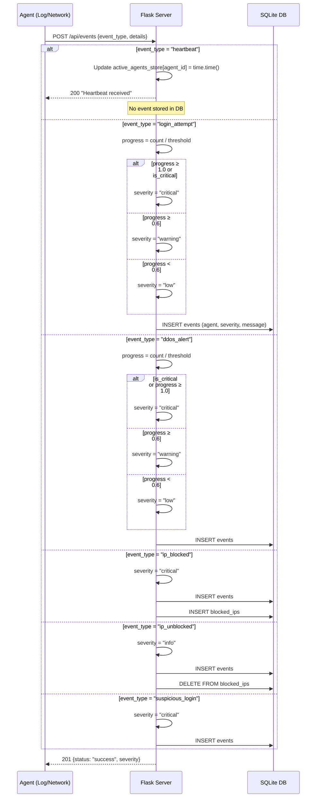
```mermaid
sequenceDiagram
    participant Agent as Agent (Log/Network)
    participant SRV as Flask Server
    participant DB as SQLite DB

    Agent->>SRV: POST /api/events {event_type, details}

    alt event_type = "heartbeat"
        SRV->>SRV: Update active_agents_store[agent_id] = time.time()
        SRV-->>Agent: 200 "Heartbeat received"
        Note over SRV: No event stored in DB
    else event_type = "login_attempt"
        SRV->>SRV: progress = count / threshold
        alt progress ≥ 1.0 or is_critical
            SRV->>SRV: severity = "critical"
        else progress ≥ 0.6
            SRV->>SRV: severity = "warning"
        else progress < 0.6
            SRV->>SRV: severity = "low"
        end
        SRV->>DB: INSERT events (agent, severity, message)
    else event_type = "ddos_alert"
        SRV->>SRV: progress = count / threshold
        alt is_critical or progress ≥ 1.0
            SRV->>SRV: severity = "critical"
        else progress ≥ 0.6
            SRV->>SRV: severity = "warning"
        else progress < 0.6
            SRV->>SRV: severity = "low"
        end
        SRV->>DB: INSERT events
    else event_type = "ip_blocked"
        SRV->>SRV: severity = "critical"
        SRV->>DB: INSERT events
        SRV->>DB: INSERT blocked_ips
    else event_type = "ip_unblocked"
        SRV->>SRV: severity = "info"
        SRV->>DB: INSERT events
        SRV->>DB: DELETE FROM blocked_ips
    else event_type = "suspicious_login"
        SRV->>SRV: severity = "critical"
        SRV->>DB: INSERT events
    end

    SRV-->>Agent: 201 {status: "success", severity}
```
